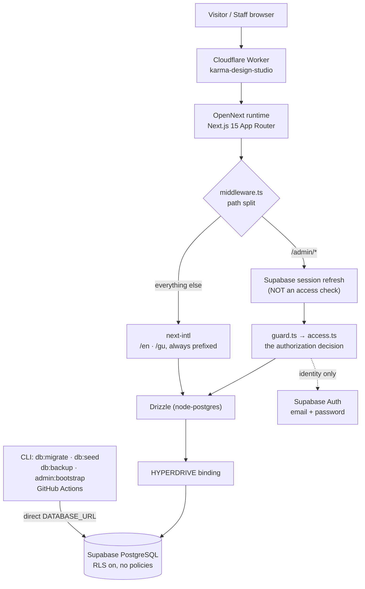
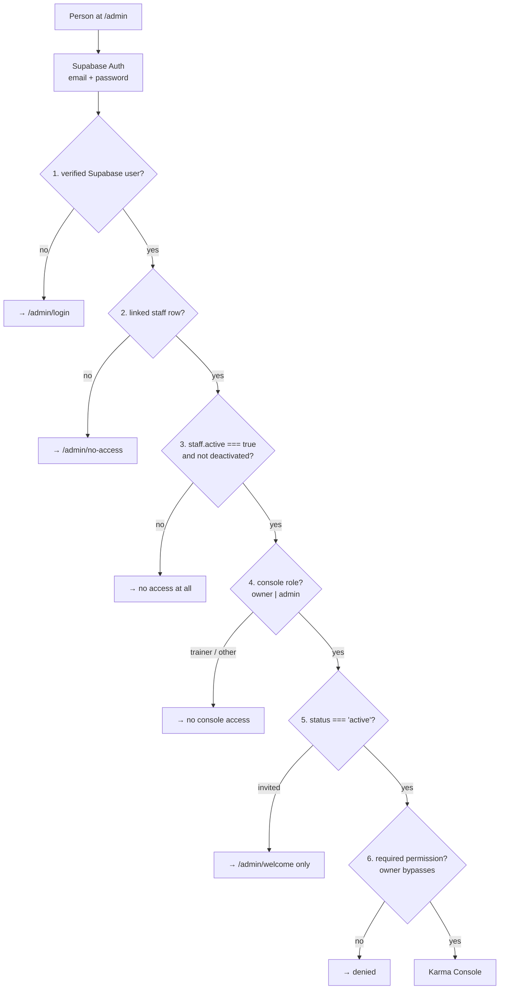

# Karma Design Studio — project context

**The durable memory of this project.** If every prior conversation with every
AI assistant vanished tomorrow, this file plus the code on `main` should be
enough for a new engineer — human or AI — to understand what exists, why it was
built this way, what is deliberately unfinished, and how to continue without
breaking something expensive.

It is written to be read, not skimmed. Read it before significant work.
`CLAUDE.md` is the short contract; this is the reasoning behind it.

| | |
| --- | --- |
| **Written** | 2026-08-30 |
| **Verified against** | `main` after PRs #24-#27 — the operational work of 2026-08-30 |
| **Last substantive update** | 2026-08-30 — the owner's verified EMCAD DAHAO facts, the course operational model and migration `0004` |
| **Rule** | Where this document and the code disagree, **the code is right.** Fix the document. |

---

## Table of contents

1. [Project identity](#1-project-identity)
2. [Product and business positioning](#2-product-and-business-positioning)
3. [Repository and branch workflow](#3-repository-and-branch-workflow)
4. [Application stack](#4-application-stack)
5. [Directory and system map](#5-directory-and-system-map)
6. [Public site architecture](#6-public-site-architecture)
7. [Design system and the Screen-to-Stitch redesign](#7-design-system-and-the-screen-to-stitch-redesign)
8. [Bilingual EN/GU](#8-bilingual-engu)
9. [Karma Console architecture](#9-karma-console-architecture)
10. [Authentication and staff access](#10-authentication-and-staff-access)
11. [Roles and permissions](#11-roles-and-permissions)
12. [Supabase](#12-supabase)
13. [PostgreSQL and the data access layer](#13-postgresql-and-the-data-access-layer)
14. [Drizzle and migrations](#14-drizzle-and-migrations)
15. [Hyperdrive](#15-hyperdrive)
16. [Cloudflare Workers and OpenNext](#16-cloudflare-workers-and-opennext)
17. [Deployment workflow](#17-deployment-workflow)
18. [Environment variables (names only)](#18-environment-variables-names-only)
19. [Email and SMTP](#19-email-and-smtp)
20. [Database tables and domain model](#20-database-tables-and-domain-model)
21. [Courses and batches](#21-courses-and-batches)
22. [Admissions](#22-admissions)
23. [Students](#23-students)
24. [Attendance](#24-attendance)
25. [Fees](#25-fees)
26. [Certificates](#26-certificates)
27. [B2B / Design Desk](#27-b2b--design-desk)
28. [Content Desk](#28-content-desk)
29. [Reports, exports and audit](#29-reports-exports-and-audit)
30. [Analytics](#30-analytics)
31. [SEO and structured data](#31-seo-and-structured-data)
32. [Machine Notes](#32-machine-notes)
33. [Security model](#33-security-model)
34. [RLS and the data-access rationale](#34-rls-and-the-data-access-rationale)
35. [Testing and CI](#35-testing-and-ci)
36. [Milestones and pull-request history](#36-milestones-and-pull-request-history)
37. [Public factual-data policy](#37-public-factual-data-policy)
38. [Sample-content policy](#38-sample-content-policy)
39. [Open owner questions](#39-open-owner-questions)
40. [Deferred infrastructure](#40-deferred-infrastructure)
41. [Launch and cutover plan](#41-launch-and-cutover-plan)
42. [Operational gotchas](#42-operational-gotchas)
43. [Do not undo these decisions](#43-do-not-undo-these-decisions)
44. [Non-secret identifiers and URLs](#44-non-secret-identifiers-and-urls)
45. [How to start a new task here](#45-how-to-start-a-new-task-here)
46. [Documentation index](#46-documentation-index)

---

## 1. Project identity

| | |
| --- | --- |
| **Repository** | `optimisticjp/Karma` (GitHub) |
| **Package name** | `karma-design-studio` |
| **Business** | Karma Design Studio & Classes — an embroidery training institute and B2B embroidery design lab |
| **Location** | 302, Middle Point, Maruti Nandan Society, Mahadev Chowk, Mota Varachha, Surat, Gujarat 394101 |
| **Landmark** | Near Dhara Arcade, opposite Krishna Township Road |
| **Two products in one repo** | the **public bilingual website** (`/en`, `/gu`) and **Karma Console**, the private staff operations desk (`/admin`) |
| **Live review URL** | `https://karma-design-studio.essanciaonline.workers.dev` |
| **Custom domain** | `karmadesignstudio.in` — **not connected**, deliberately. See §41. |

The business has two sides, and the site serves both without pretending they
are equal. The **training academy** is the primary funnel — live-machine
embroidery courses taught in Gujarati and Hindi, converting mostly from
Instagram and Facebook on a phone. The **studio (B2B)** side does
machine-ready embroidery design, digitising, sample reconstruction and
production correction for boutiques and manufacturers. Training leads.

---

## 2. Product and business positioning

The positioning was chosen deliberately during the Screen-to-Stitch redesign
and is not a matter of taste to be re-litigated by the next visual pass.

**Karma is Surat's machine-led commercial embroidery learning studio** — not a
generic creative-course provider, not a craft school.

**Brand thesis:** *From Screen to Stitch.*
**Supporting promise:** *Design on screen. Prove it on the machine.*

Personality: expert not academic · ambitious not flashy · technical not cold ·
local not provincial · premium without luxury-for-its-own-sake · direct not
corporate.

The site must **not** read as: a generic coaching-centre template, a pastel
craft blog, a bridal catalogue, a software reseller, a stock-photo college, or
a loud red/yellow local advertisement. Those six are written down because each
one is a plausible drift the next redesign could produce by accident.

**Why this works commercially.** The studio's real advantage is that it teaches
on production machines and speaks the language of the floor — thread and needle
matching, density, pathing, registration, sequence, emCAD/Wilcom judgement. Its
social presence (Gujarati-led, founder-led, practical) already proves this. The
website's job is to make that legible in thirty seconds to someone holding a
phone, and then get them to call for a demo. It is not to look like a
university.

Full audience model, conversion reasoning and phase-by-phase decisions:
`docs/screen-to-stitch-progress.md`.

---

## 3. Repository and branch workflow

- Default branch: **`main`**. Do not push to it directly.
- Work happens on a feature branch → pull request → **GitHub CI green** and
  **Cloudflare preview build green** → merge.
- Cloudflare's Git integration builds and deploys from `main` automatically;
  pull requests get a preview build. **Nobody deploys by hand.**
- Merges have historically been merge commits carrying the PR title.
- Every operational record in the app is archived, deactivated or
  lifecycle-transitioned rather than hard-deleted. The same instinct applies to
  documentation: historical plans are annotated, not erased.

---

## 4. Application stack

Versions are from `package.json` at the verified commit. Check it rather than
trusting this table after a dependency bump.

| Layer | Choice | Version |
| --- | --- | --- |
| Framework | Next.js App Router | `15.5.22` |
| UI | React / React DOM | `19.1.x` |
| Language | TypeScript (strict) | `^5` |
| Styling | Tailwind CSS v4 (`@tailwindcss/postcss`) | `^4.3.3` |
| i18n | `next-intl` | `^4.13.4` |
| ORM | `drizzle-orm` (+ `drizzle-kit`) | `^0.45.2` / `^0.31.10` |
| Postgres driver | `pg` (`drizzle-orm/node-postgres`) | `^8.23.0` |
| Auth | `@supabase/supabase-js` + `@supabase/ssr` | `^2.112.4` / `^0.12.5` |
| Validation | `zod` | `^3.25.76` |
| Server boundary | `server-only` | `^0.0.1` |
| Fonts | `@fontsource-variable/` manrope · playfair-display · noto-sans-gujarati | `^5.3.0` |
| Deploy adapter | `@opennextjs/cloudflare` | `^1.20.2` |
| CLI | `wrangler` | `^4.115.0` |
| Tests | `vitest` | `^4.1.10` |
| Runtime | Node | **22** (CI and devcontainer) |

**There is no UI component kit, no chart library, no CSS-in-JS runtime, no
state-management library and no animation library.** That is deliberate: the
Worker has a size budget (§42), and the design system is hand-built.

**Do not migrate to Next.js 16.** The skill library vendored in `.claude/skills/`
comes from a Next 16 starter template; its version is irrelevant here. Karma's
Next version is coupled to `@opennextjs/cloudflare`, the Hyperdrive binding and
a working production deploy.

---

## 5. Directory and system map

```
src/
  app/
    [locale]/            public bilingual pages (en, gu)
    admin/               Karma Console — deliberately OUTSIDE [locale]
      (auth)/            login · welcome · no-access  (unauthenticated shells)
      (console)/         the authenticated console
      auth/callback/     Supabase invitation token-hash callback
    api/                 admission · batches · brief · health · cron/digest
    globals.css          design system v3 tokens + base layers
    premium.css          the "Machine Floor Ledger" product pass
    sitemap.ts robots.ts icon.svg global-error.tsx
  components/
    site/ home/ course/ work/ forms/ ui/ admin/
  content/               courses.ts · notes.ts · collections.ts  (source-of-truth content)
  i18n/                  routing.ts · request.ts · navigation.ts
  lib/
    admin/               per-module server logic + bilingual copy
    auth/                access.ts (pure) · guard.ts · permissions.ts · seats.ts · staff.ts …
    content/public.ts    Content Desk → public site, with source fallbacks
    db/                  schema.ts · content-schema.ts · index.ts · queries.ts
    supabase/            client.ts · server.ts · admin.ts · middleware.ts · env.ts
    analytics.ts schema.ts seo.ts site.ts env.ts email.ts files.ts r2.ts
    turnstile.ts phone.ts validation.ts api.ts youtube.ts utils.ts
  middleware.ts
messages/{en,gu}.json    UI copy catalogues (mirrored keys)
drizzle/                 SQL migrations + meta snapshots
scripts/                 seed · backup · bootstrap-owner · sync-claude-skills.sh
tests/                   vitest suite
docs/                    this file and its companions
.claude/skills/          322 vendored Claude skills (see docs/claude-skills.md)
.specify/                Spec Kit machinery for the speckit-* skills
```

### Request architecture



The two paths to Postgres are the thing to internalise: **the deployed Worker
goes through Hyperdrive; everything that runs outside the Worker uses a direct
`DATABASE_URL`.** GitHub Actions cannot use Hyperdrive, which is why the weekly
backup holds its own database secret.

---

## 6. Public site architecture

Routes under `src/app/[locale]/`, each existing at both `/en/…` and `/gu/…`:

| Route | What it is |
| --- | --- |
| `/` | Homepage — the 30-second decision |
| `/courses` · `/courses/[slug]` | Catalogue index and per-course pages |
| `/admission` | The multi-step demo/admission form |
| `/admissions` | Admissions information page |
| `/about` | The studio's story |
| `/services` | Karma Studio — the B2B side |
| `/notes` · `/notes/[slug]` | Machine Notes (§32) |
| `/student-work` | Gallery |
| `/success-stories` | Student outcome stories |
| `/contact` | Contact + wayfinding |
| `/verify` · `/verify/[id]` | Public certificate verification |
| `/privacy` · `/terms` | Legal drafts (`noIndex` until owner review) |
| `[...rest]`, `not-found`, `error`, `loading` | Catch-all and boundaries |

**Locale routing.** `src/i18n/routing.ts`: locales `["en","gu"]`,
`defaultLocale: "en"`, **`localeDetection: false`**. The URL alone decides the
language; there is no browser-language auto-redirect (Google's i18n guidance).
A one-time dismissible banner (`LangBanner`) offers the other language instead.
Making Gujarati the default is a one-line change and an open owner question
(§39, Q5).

**`/admin` sits outside `[locale]` on purpose** — staff type `/admin`, not
`/en/admin`. `src/middleware.ts` splits on the path: `/admin/*` gets a Supabase
session refresh and nothing else; every other path goes to next-intl unchanged.
Middleware is explicitly **not** an access check.

**API routes** (`src/app/api/`): `admission` and `brief` (public form intake,
fail-closed), `batches` (real batch data for the homepage, edge-cached ~5 min),
`health` (readiness booleans), `cron/digest` (POST, `Bearer CRON_SECRET`).

**Redirects** in `next.config.ts` map old template URLs
(`/flat-embrodary`, `/about-us`, `/courses`, …) to the new pages, so legacy
inbound links do not 404 after the eventual cutover.

**Mobile conversion.** The earlier five-tab mobile navigation was deliberately
replaced with a fixed bottom bar carrying exactly **two** actions — **Call for
demo** and **Directions**. Navigation belongs in the header menu. The reasoning:
most visitors arrive mobile-first from Instagram, Facebook or search, and the
only two things worth a permanent thumb-reachable slot are the two that convert.
`tests/mobile-conversion.test.ts` enforces the phone-role rules behind it (§37).

---

## 7. Design system and the Screen-to-Stitch redesign

Current system: **v3, "Screen to Stitch / The Machine Floor"**, superseding v2
("The Digital Thread"). Implemented in `src/app/globals.css` (tokens, base
layers, rhythm utilities) and `src/app/premium.css` (the "Machine Floor Ledger"
product pass). Canonical spec: `docs/design-system.md`.

**Palette** — Tailwind v4 `@theme` tokens in `globals.css`, with contrast ratios
recorded in the source next to each value:

| Token | Value | Role |
| --- | --- | --- |
| `--color-ivory` | `#f5f0e6` | Cotton — page background |
| `--color-ivory-2` | `#e9decd` | Raw Silk — alternating band |
| `--color-sand` | `#ded0b8` | deeper warm surface |
| `--color-card` | `#fffdf8` | Worktable — reading surface |
| `--color-line` | `#d5cab6` | thread-grey borders |
| `--color-carbon` | `#111716` | Machine Black |
| `--color-steel` | `#172b35` | Steel Indigo |
| `--color-stone` | `#605e56` | secondary text |
| `--color-needle` / `-light` | `#29617a` / `#7fb3c9` | Needle Blue |
| `--color-zari` / `-deep` | `#aa6239` / `#8a4e2c` | Zari Copper — editorial |
| `--color-vermilion` / `-deep` | `#c54832` / `#a93a27` | **the** interface accent |
| `--color-success` / `-warn` / `-error` | | **status only**, never decoration |

**Typography.** Manrope Variable (display + body), Playfair Display Variable
italic (sparing editorial accent, imported as the `wght-italic` subset only),
Noto Sans Gujarati Variable (declared as a local `@font-face` from the
fontsource package). A clamp-based scale from `--text-display-xl` down to
`--text-eyebrow` lives in the same `@theme` block. **Never uppercase or
letterspace Gujarati.**

**Signature devices.** Stitch paths (`<StitchPath>`, `<StitchRule>`,
`<StitchDivider>`) draw fine stitch lines with knot dots and emCAD-style vector
nodes; `<TechniquePlate>` renders drawn material swatches; `.ledger` /
`.spec-grid` / `.on-carbon` compose the machine-floor bands; `<PhotoSlot>` and
`<ManagedPhoto>` hold named, labelled places for photography that does not exist
yet; `.pending-block` marks content the owner still owes. Motion is
`prefers-reduced-motion`-aware and JS-gated so no-JS users see everything.

**Rhythm is a system, not per-screen improvisation:** `.u-lede`,
`.u-eyebrow-gap`, `.u-actions`, `.u-section-body`, plus three section tiers.
Read `docs/design-system.md` before adding spacing.

### The 10-phase redesign

Planned in `docs/screen-to-stitch-progress.md` and implemented in PRs **#12–#21**,
one phase per PR, each with an "Implementation record" written back into that
document as it landed:

| Phase | PR | Delivered |
| --- | --- | --- |
| 1 | #12 | Brand system + design foundations |
| 2 | #13 | Homepage — the 30-second decision |
| 3 | #14 | Production-led course architecture |
| 4 | #15 | Proof ecosystem: machine notes, work, stories, trainers, reviews |
| 5 | #16 | Mobile conversion: two actions, two phone roles, no PII |
| 6 | #17 | Karma Studio — problem-led B2B |
| 7 | #18 | Machine Notes |
| 8 | #19 | One door for structured data + launch steps |
| 9 | #20 | Accessibility, performance, responsive hardening |
| 10 | #21 | Final creative audit and the blockers written down |

`docs/screen-to-stitch-progress.md` is ~2 500 lines and is the best record of
*why* the public site is shaped the way it is. Keep it; do not "tidy" it.

**Do not replace this system with a generic design system** — including the one
belonging to the skill-library template in `.claude/skills/`.

### v4 — "Machine Lab" (from 2026-08-30)

The owner's full-product redesign brief is
`docs/karma-machine-lab-redesign-master-plan.md`, executed in fourteen phases.
**v4 extends v3; it does not replace it.** No v3 token was renamed or retuned,
because `globals.css` is shared with Karma Console and a rename silently
restyles the admin. Everything v4 adds is additive.

**Cascade order — this matters and is easy to get wrong:**

```
globals.css (@layer base, components)  →  premium.css  →  machine-lab.css
```

`premium.css` is deliberately *unlayered*, so it outranks every `@layer` in
`globals.css`. A v4 primitive placed in `globals.css` would therefore lose to
any v3 rule in `premium.css` touching the same property. `src/app/machine-lab.css`
is likewise unlayered and imported **after** `premium.css` in both root layouts
(`src/app/[locale]/layout.tsx` and `src/app/admin/layout.tsx`).
`tests/machine-lab-system.test.tsx` asserts that import order.

**What v4 adds:**

| Piece | Where | Note |
| --- | --- | --- |
| Machine-notation tokens | `globals.css` `@theme` | `--font-mono` is the **platform** monospace stack. No new font was loaded; the project still imports exactly two `@fontsource` families, and a test enforces it. |
| Motion levels 1–4 | `--dur-l1`…`--dur-l4`, `--ease-machine` | Level 4 is the one signature moment a page is allowed. There is no level 5. |
| Texture tokens | `--texture-ink`, `--texture-strength` | Strength is capped at 2–5% by test. |
| The Karma Stitch icon family | `src/components/ui/Icon.tsx` | Four branded groups (production, technique, digitising, troubleshooting) plus deliberately ordinary universal actions. **Branded concepts get niche icons; universal actions keep universal icons** — nobody decodes an embroidery symbol to find Edit. |
| Eleven technique signatures | `src/components/ui/TechniqueSignature.tsx` | One per course slug, keyed by slug and asserted against `src/content/courses.ts`. Each builds itself **once** on first reveal and stops; nothing loops. |
| Canonical stitch marks | `src/components/ui/StitchMark.tsx` | Six marks, six meanings, exported as `STITCH_SEMANTICS`. Running stitch and thread path stay in `StitchPath.tsx`. |
| Machine notation | `src/components/ui/MonoNote.tsx` | `01 DESIGN`, `EMCAD / PATH`, indexes. Not body copy, not navigation, not buttons. |
| Textures, glass, machine light, motion utilities, signature CSS | `src/app/machine-lab.css` | One glass treatment only (`.lab-glass`); there is deliberately no card variant. |

**The 32-photograph manifest.** `src/content/photo-manifest.ts` is the typed
list of every shot on the owner's final brief, with each slot's intrinsic
dimensions. `<ManifestPhoto id="…">` reserves the photograph's exact aspect
ratio, so swapping the real file in later causes **zero layout shift**. A slot
that has no photograph renders as an honest labelled frame. It is never filled
with stock, a generated image, another institute's work, or another course's
photograph — see §38 and `docs/content-checklist.md` §B.

**Nothing drawn may invent a specification.** No RPM, stitch density, GSM,
machine ratio, CAD coordinate, machine model or head count appears anywhere in
the signature or icon geometry, and tests fail if one does. A drawing that
invents a number is the same lie as a stock photograph, only harder to spot.

**Testing note.** `vitest.config.ts` now sets `oxc.jsx.runtime = "automatic"`.
`tsconfig.json` sets `jsx: "preserve"` because Next.js runs its own transform;
without the override a test importing a `.tsx` component sees raw JSX and fails
to parse. This changes nothing about how the application is built.

---

## 8. Bilingual EN/GU

Both languages are first-class. Gujarati is not a translation afterthought: it
is the language most of the audience actually speaks, and the copy is natural
Surti Gujarati/Gujlish rather than formal translated Gujarati. Trade terms that
the trade says in English — emCAD, machine, batch, WhatsApp — stay in English
inside Gujarati sentences, because that is how the floor talks.

Mechanics:

- `messages/en.json` and `messages/gu.json` carry mirrored keys.
  `tests/i18n-parity.test.ts` fails the build if a key exists in one and not the
  other. This is deliberately mechanical — it catches the common failure (a new
  English string shipped without its Gujarati twin) without pretending to judge
  translation quality.
- Content in `src/content/*.ts` carries paired `…En` / `…Gu` fields.
- `src/lib/site.ts` holds `addressEn` / `addressGu`, `hoursEn` / `hoursGu`.
- The console has its own bilingual copy modules (`src/lib/admin/*-copy.ts`) and
  a staff locale toggle.
- Every public page emits `en`, `gu` and `x-default` hreflang alternates through
  `pageMeta()` in `src/lib/seo.ts`. A page that skips that helper is the usual
  cause of a Search Console hreflang error.

---

## 9. Karma Console architecture

**Karma Console** is the private staff product at `/admin`. Dashboard is called
**"Today at Karma"**. Canonical reference: `docs/admin-architecture.md`.

It is an operating system for *one* embroidery academy and design lab — an
academy CRM, a studio operations desk and an embroidery production desk in one.
It is deliberately **not** a generic school ERP and not a generic admin
template. Staff language is institute language: enquiry, walk-in, follow-up,
batch, fees, receipt, હાજરી, certificate, design job, WhatsApp.

Route groups: `(auth)` for the unauthenticated shells (login, welcome,
no-access) and `(console)` for the authenticated product. Console pages are
`force-dynamic` so authenticated content can never leak into build output or an
edge cache.

Navigation, from `src/app/admin/(console)/layout.tsx`, in three permission-aware
sections:

| Section | Entries |
| --- | --- |
| Operations | Today · Admissions · Students · Fees |
| Studio | Courses & Batches · Attendance · Design Desk · Certificates · Content · Reports |
| Administration | Team *(owner only)* · Account & security |

A link the caller cannot use renders disabled rather than linking. **Hidden
navigation is UX, never security** — every page and every server action
re-checks server-side.

Two product rules that shape every module:

- **Website forms are never a prerequisite.** Authorised staff can add
  enquiries, direct admissions, students, fee entries and design jobs by hand,
  for a walk-in, a phone call or a WhatsApp message. The public form is one
  intake path among several, not the system of record.
- **No hard-delete UI for operational records.** Archive, deactivate and
  lifecycle transitions preserve history.

Dates that mean "today" to staff are pinned to **`Asia/Kolkata`**, not to the
Worker's UTC clock.

### 9a. What may be done to a record (2026-08-30)

The owner replaced the blanket "archive, never hard-delete" rule. Five verbs —
**add · edit · archive · restore · delete** — and one table decides which of
them each kind of record gets: `src/lib/admin/record-actions.ts`. Every module
reads it; none invents its own rule. `tests/record-actions.test.ts` pins it.

Three principles:

1. **Archive is ordinary; deletion is the exception.** Archiving is reversible
   and loses nothing. Deletion is for a record that should never have existed —
   a duplicate, a test row, a mistaken entry — not for tidying up.
2. **Deletion is Owner-only**, even for an admin holding every manage
   permission there is. Destroying history is not a delegated capability, and
   the test that asserts this for an admin-with-everything is the most important
   one in that file.
3. **Some things are never deletable.** `audit_logs` is the evidence that a
   deletion happened, so a system that could delete it would have no evidence at
   the moment it mattered most. `attendance_corrections` and
   `attendance_records` are the record that a locked register was changed.
   `enrollments` carry the fee agreement a student signed. Staff accounts are
   deactivated — audit rows must keep pointing at a real identity, and the
   `karma_staff_invariants` trigger refuses a DELETE of the owner row whatever
   the application believes.

**Dependencies block, they do not cascade.** `courses → batches` and
`batches → enrollments` are declared `ON DELETE CASCADE` in the schema, so
deleting a course really *would* take every batch, enrolment, attendance record,
fee row and certificate under it. `RECORD_POLICY[...].blockedBy` is what stops
that from ever being one click: the operator is shown the counts and has to deal
with them deliberately. **Never add a cascade to route around a block.**

Two records refuse deletion outright for reasons of their own:

| Record | Refusal |
| --- | --- |
| A **locked** attendance session | Locking is the moment a register became a record. Use a correction. |
| An **un-revoked** certificate | Its verification URL may be with an employer. A 404 reads as a forgery; a revoked certificate reads as what it is. Revoke first. |

**The flow, and the order matters:** authorize → preflight → confirm →
**write the tombstone** → delete, with the last two in one transaction. Writing
the audit row afterwards would mean a failure between them left a deletion with
no record of who did it or what was destroyed.

Deletion goes through its own page — `/admin/records/[entity]/[id]/delete`,
`requireOwner` at the page and `ownerOnly` again in the action — because the
operator has to see what depends on the record before confirming, and a
dependency count is a query that must not run for every row of a list. The
confirmation is **typed**: the record's own identifier for anything expensive
(an admission number, a course slug, a certificate number), the word DELETE for
a row with no dependent history. Typing `KDS-2026-0142` requires having read
which student this is; typing DELETE only requires wanting to get past a dialog.

**The tombstone is deliberately short.** A handful of non-secret identifying
fields per entity — never the whole row. An audit table full of phone numbers is
a second place personal data lives, with none of the retention thinking the
first one gets. Never a password, token, key or credential of any kind.

**An archived record is out of every operational picker** — the admission batch
picker, the attendance batch picker, the enquiry course picker and the public
`/api/batches` feed — and still findable behind an "include archived" toggle on
its own list. Hiding it permanently would make an archived record
indistinguishable from a deleted one, which is the distinction the whole model
is trying to teach.

---

## 10. Authentication and staff access

**Supabase Auth proves identity. The Karma `staff` row decides authorization.**
That sentence is the entire model; everything else is detail.



The decision is a **pure function** in `src/lib/auth/access.ts`
(`evaluateAccess`, `evaluateOnboardingAccess`, `hasPermission`), unit-tested and
independent of any framework. `src/lib/auth/guard.ts` wraps it for real requests
and exposes `requireAdmin`, `requireOwner`, `requirePermission`,
`authorizeAction`, `currentCan`, `requireInvitedConsoleUser`. **Every protected
page and server action goes through those.** Never inline a role check.

**Karma Console is password-only.** There is no MFA, no TOTP enrolment, no AAL2
gate. This was decided by the owner and implemented in **PR #5**
(`fix/password-only-admin`). The `currentLevel` / `nextLevel` AAL fields still
exist on the access subject and `mfa-setup` / `mfa-challenge` still exist as
redirect reasons — carried for compatibility with existing sessions and legacy
routes, gating nothing. **Do not restore a gate.** See §43.

**No public sign-up.** No registration route, no self-service role selection, no
password reset that could enumerate addresses. Every account arrives by owner
invitation. The single Owner arrives through a CLI bootstrap
(`npm run admin:bootstrap`) that refuses to create a second one and refuses to
adopt a pre-existing Supabase identity — only the auth user that a successful
invitation just created is ever linked.

**Invitations are a token-hash flow, not PKCE.** `inviteUserByEmail()` does not
support PKCE, so `/admin/auth/callback` verifies `token_hash` with `type`
compared for **equality** against `"invite"` — never cast into `EmailOtpType`,
so a `recovery`, `signup` or `magiclink` link cannot enter admin onboarding
through that endpoint. **The Supabase "Invite user" email template must be the
token-hash form** (exact snippet in `docs/admin-architecture.md` §9); the stock
template returns the session in a URL fragment, which a server-side app can
never read, so every invitation would dead-end.

**Acceptance is transactional**: `invited → active`, `accepted_at` and the
`admin.accepted` audit row commit together or not at all; retries are
idempotent.

**Sign-in** runs as a Server Action with Karma's own per-IP and per-email rate
limiting on top of Supabase's, and exactly one generic failure message
(`Email or password is incorrect.`) whatever went wrong — it never reveals
whether an address exists, whether an account is deactivated, or whether it is
the Owner.

**Sign-out** is a POST with `scope: "global"` — it revokes the refresh token,
which it can do because it runs with the person's own session.

**Deactivation** sets `active = false` and `status = 'deactivated'`; every
protected request re-reads the row, so the account is refused on its very next
request. Supabase is *additionally* asked to ban the user
(`ban_duration: '876000h'`), inspected and logged as a status only. Two claims
are deliberately **not** made: this is not session revocation
(`auth.admin.signOut()` needs a live JWT, not a user id), and disabling the
Karma account does not invalidate an already-issued Supabase token — what it
guarantees is that the token *buys nothing*, because authorization is Karma's
decision, made from the database on every request. The auth user is never
deleted; audit rows must keep pointing at a real identity.

**Reactivation reads `accepted_at`, not `status`** — an account that never
accepted returns to `invited` and still owes onboarding. Reading `status` would
silently promote them.

---

## 11. Roles and permissions

**Exactly one Owner + at most five enabled Admins.** The Owner does not count
toward the five.

| Role | Console access |
| --- | --- |
| `owner` | everything, always; **bypasses the permission table entirely** |
| `admin` | only what has been explicitly granted; capped at five enabled accounts |
| `trainer` | none (yet) — a staff record without console login, preserved from before the console existed |

A **seat** is consumed by any admin row with `active = true`, *including a
pending invitation* — the seat is reserved the moment the invite goes out,
because the person can accept at any time. Deactivating an admin frees it
immediately.

`staff.status` lifecycle — `active` is the master switch, `role` is the
capability, `status` is where the account is in its life:

| status | Seat | May reach | May not reach |
| --- | --- | --- | --- |
| `invited` | **yes** | `/admin/welcome` only | any console page or server action |
| `active` | yes | the console, subject to permissions | — |
| `deactivated` | no | nothing at all | onboarding screens included |

**Owner privileges are never represented as grants**, so they can never be
partially revoked by editing rows. Conversely an admin has **no implicit
baseline** — an admin with no grants can reach nothing.

The 23 permission keys (`src/lib/auth/permissions.ts`):

```
dashboard.view
applications.view    applications.manage
students.view        students.manage
courses.view         courses.manage
batches.view         batches.manage
attendance.view      attendance.manage
design.view          design.manage
certificates.view    certificates.manage
content.view         content.manage
fees.view            fees.manage
reports.view   audit.view   exports.run   settings.view
```

They are grouped for the permission editor into: overview · admissions ·
students · teaching · designLab · certificates · content · fees · insight.

Six **templates** — `admissions`, `academy`, `designLab`, `operations`,
`content`, `custom` — are *starting points, not roles*. The owner picks one when
inviting and then edits freely; nothing remembers which template was used, so a
template can never quietly re-assert itself later.

**Team administration is Owner-only and deliberately has no permission key at
all**, so it cannot be granted to an admin. `parsePermissions()` rejects the
whole request if any key is unrecognised rather than silently dropping a typo
(which would quietly grant less than intended).

The seat cap and owner invariants are enforced **twice**: in the application
(`src/lib/auth/seats.ts`) and in the database, by the `karma_staff_invariants`
trigger with an advisory lock (migration `0002`), so a race between two
simultaneous invitations cannot slip past. The trigger fires on
`BEFORE INSERT OR UPDATE OR DELETE`, so `delete from staff where role='owner'`
is refused too. The owner row allows exactly one transition —
`invited → active` — and refuses demotion, deactivation and deletion.

---

## 12. Supabase

| | |
| --- | --- |
| Project | `karma-design-studio-dev` |
| Project ref | `zauklynwqdjlgqdpwczy` (visible in the CSP `connect-src` in `next.config.ts` — a public identifier, not a credential) |
| Region | Mumbai / `ap-south-1` (per the owner's project setup; the repository does not assert this) |
| Used for | PostgreSQL **and** Supabase Auth **and** auth/invitation SMTP |
| Not used for | Supabase Storage, and the Supabase Data API (PostgREST) for app tables |

Key model — the legacy `anon` / `service_role` names are **not** used:

| Variable | Where | Notes |
| --- | --- | --- |
| `NEXT_PUBLIC_SUPABASE_URL` | build var | public |
| `NEXT_PUBLIC_SUPABASE_PUBLISHABLE_KEY` | build var | public by design; ships in the browser bundle |
| `SUPABASE_SECRET_KEY` | **runtime secret** | privileged; `server-only`, never logged, never serialised, never `NEXT_PUBLIC_` |

Three clients, three jobs (`src/lib/supabase/`):

| Module | Key | Job |
| --- | --- | --- |
| `client.ts` | publishable | browser, **auth flows only** — not a data client |
| `server.ts` | publishable | SSR cookie session for Server Components/Actions/Route Handlers |
| `admin.ts` | **secret** | `server-only`; one job, admin invitations. `persistSession: false`, `autoRefreshToken: false` |

`getUser()` is used everywhere, **never `getSession()`** — `getSession` returns
whatever is in the cookie without contacting Supabase, so it can be replayed.

Supabase Auth dashboard settings this app depends on: email provider **on**,
public sign-ups **off**, anonymous auth **off**, manual linking **off**, email
confirmation **on**, third-party providers **off**, and the **Invite user email
template replaced with the token-hash form**. TOTP may exist as a Supabase
platform capability; **Karma does not use it** (§10, §43).

---

## 13. PostgreSQL and the data access layer

**One data layer: Drizzle over a trusted server connection.** Not the Supabase
JS client, not `.from()`, not PostgREST. See §34 for why.

Two connection paths, and the distinction matters:

| Path | Used by | Connection |
| --- | --- | --- |
| **Worker runtime** | every page, route handler and server action | `env.HYPERDRIVE.connectionString` |
| **CLI / Actions** | `db:generate`, `db:migrate`, `db:seed`, `db:backup`, `admin:bootstrap`, the backup workflow | direct `DATABASE_URL` |

`src/lib/db/index.ts` resolves them in that order and falls back to
`DATABASE_URL` when the Hyperdrive binding is absent. **That fallback is why
`npm run build`, `npm test` and local development need no Cloudflare at all** —
Hyperdrive is never required for a build to succeed. The binding is read through
OpenNext's public `getCloudflareContext()` in **sync** mode: it resolves from
the context the Worker entrypoint has already installed and throws everywhere
else, and *that throw is the fallback signal*. No OpenNext internals are
touched.

### Connection safety in a Worker

A Worker isolate is reused across requests belonging to **different people**, so
a Postgres connection must never outlive the request that opened it. Three
things guarantee that:

1. the pool is created **per request** (`cache()` scopes it to one render or
   handler invocation) — no module-scope pool;
2. `max: 1` — a request never holds more than one socket;
3. `maxUses: 1` — pg destroys the physical connection after a single checkout.

`ctx.waitUntil(pool.end())` is deliberately **not** called: `Pool.end()` marks
the pool as ending the instant it is invoked and `waitUntil` starts immediately,
which would break every query issued afterwards.

**Do not "optimise" this into a module-scope pool.** Hyperdrive does the pooling
on its side. And because `max: 1`, never check out a second client while holding
one — no nested transactions; the dashboard uses a single round trip for exactly
this reason.

---

## 14. Drizzle and migrations

- Config: `drizzle.config.ts` — `postgresql` dialect, schema from
  `./src/lib/db/schema.ts` **and** `./src/lib/db/content-schema.ts`, output to
  `./drizzle`, credentials from `DATABASE_URL`.
- The schema is split only to keep the mature operational tables stable while
  the Content Desk model was added.
- Workflow: edit the schema → `npm run db:generate` → **review the generated
  SQL** → `npm run db:migrate`.

Four migrations, applied in order:

| Tag | What it does |
| --- | --- |
| `0000_blushing_wild_pack` | The original 17 tables, enums, indexes and constraints |
| `0001_tricky_malcolm_colcord` | Indexes on hot paths, unique enrolment per (student, batch), seat/time/fee check constraints, `batches.end_date`, the idempotency key |
| `0002_admin_foundation` | `staff_permissions`; the `karma_staff_invariants` trigger + advisory lock; **RLS enabled with no policies and all grants revoked from `anon`/`authenticated`** on the then-18 app tables |
| `0003_content_desk` | `content_items`, with its own RLS lockdown |
| `0004_course_operations` | The course operational model: duration in months, software, the fee plan, the terms version, public visibility, the validated `operations` JSONB and archive columns on `courses`; the commercial-agreement snapshot on `enrollments`; father/reference/guardian-relation, preferred schedule, demo slot and terms fields on `applications`; father/reference fields on `students`; and `archived_at`/`archived_by` on `courses`, `batches`, `students` and `applications`. **Purely additive — no new tables, so migrations `0002`/`0003`'s RLS lockdown covers every new column automatically.** |

⚠ **Migration `0004` must be applied to the Supabase database** (`npm run db:migrate` with a direct `DATABASE_URL`) before the console can write a fee plan, a timetable or an archive state. Code merged ahead of it degrades rather than crashing — reads of the new columns simply come back empty — but the operational features do not work until it runs.

Migrations have been **additive only** so far. Dropping the deprecated
`students.pin` and `applications.message` columns is deliberately deferred to a
supervised destructive migration.

---

## 15. Hyperdrive

| | |
| --- | --- |
| Configuration name | `karma-supabase` |
| Configuration id | `9a02683f278543ac85f05e6b4087435a` |
| Worker binding | **`HYPERDRIVE`** — the name is load-bearing; `src/lib/db/index.ts` reads `env.HYPERDRIVE.connectionString` |
| Query caching | **off** |
| Declared in | `wrangler.jsonc` |

**The id is a Cloudflare configuration identifier, not a credential.** It is in
git on purpose. The database host, user and password live *inside* the
Hyperdrive configuration on Cloudflare and must never be committed.

**Connect Hyperdrive with the role that OWNS the tables** — the `postgres` role
in Supabase's connection string, the same one that ran the migrations. A
non-owning role would be denied by the RLS lockdown (§34). **Never "fix" that by
adding a permissive `using (true)` policy**; that would re-open the Data API to
the public publishable key.

`/api/health` reports `dbViaHyperdrive` truthfully but does **not** gate `ok` on
it: a deploy still serving through a direct `DATABASE_URL` is degraded-but-
working, and the owner should be able to see that without the monitor screaming.

**Verified live on 2026-08-30.** `/api/health` on the branch preview returned:

```json
{"ok":false,"production":true,
 "checks":{"db":true,"dbViaHyperdrive":true,"supabaseAuth":true,
           "turnstile":false,"email":false}}
```

So: **Hyperdrive is bound and is the active path** — the Worker is not on the
temporary `DATABASE_URL` fallback — and Supabase Auth is configured. The `503`
is the documented expected state, not a fault: `turnstile` is false because
Turnstile is deliberately deferred (§40), and `email` is false because
`RESEND_API_KEY` is unset on that deployment. Both gate `ok`, so a monitor
pointed at this endpoint reports down until the owner finishes Turnstile — which
is a real trade-off worth revisiting (§39), not a bug.

The same check also confirmed `/` → 307 → `/en`, and `/en`, `/gu` and
`/admin/login` all serving 200.

---

## 16. Cloudflare Workers and OpenNext

From `wrangler.jsonc`:

| Setting | Value |
| --- | --- |
| Worker name | `karma-design-studio` |
| Entry | `.open-next/worker.js` |
| Compatibility date | **`2026-07-01`** (must be ≥ 2025-04-01 so env vars/secrets auto-populate `process.env`) |
| Compatibility flags | `nodejs_compat` |
| Assets | `.open-next/assets`, binding `ASSETS` |
| Observability | enabled |
| Hyperdrive | binding `HYPERDRIVE` → `9a02683f…` |
| R2 | **commented out** — `BRIEF_FILES` → `karma-brief-files`, not activated |
| `vars` | `NEXT_PUBLIC_SITE_URL`, `STUDIO_EMAIL`, `STUDIO_WHATSAPP` (non-secret) |

**Do not casually change the compatibility date or flags.**

`open-next.config.ts` is the default `defineCloudflareConfig()`. The R2
incremental cache for ISR is available but not enabled.

**`next.config.ts` is doing three important jobs** beyond the usual:

1. `initOpenNextCloudflareForDev()` runs **only** when
   `NODE_ENV === "development"`. Running it during `next build` would make the
   build depend on emulating every binding locally — and with `HYPERDRIVE`
   bound, miniflare demands a local Postgres connection string and rejects
   without one, **failing CI and the Cloudflare build**. It is wrapped in a
   `catch` so a missing proxy is never fatal.
2. Security headers, including a deliberately tight CSP where every third-party
   host is an **exact origin, never a wildcard**. `connect-src` carries
   `https://challenges.cloudflare.com` (Turnstile) and the full Supabase project
   origin — written out rather than `*.supabase.co`, because the wildcard would
   allow XHR to every Supabase project on the internet. **Changing the Supabase
   project means updating the CSP**; `tests/csp.test.ts` pins the directive.
3. Legacy-URL redirects (§6).

**Never `export const runtime = "edge"`.** OpenNext handles runtime selection.

---

## 17. Deployment workflow

Cloudflare's Git integration is connected. Pushing to `main` builds and deploys;
pull requests get a preview build. **Nobody deploys by hand.**

Build command:

```
npx @opennextjs/cloudflare build
```

**Production deploy command — this one has history, do not "simplify" it:**

```
OPEN_NEXT_DEPLOY=true npx wrangler deploy --keep-vars
```

Preview / version uploads:

```
npx wrangler versions upload --keep-vars
```

**Why.** Wrangler/OpenNext previously attempted **local Hyperdrive proxy
delegation** during the production deploy, which fails in the Cloudflare build
environment. Setting `OPEN_NEXT_DEPLOY=true` and calling `wrangler deploy`
directly — rather than going through OpenNext's delegated deploy path — was the
fix. `--keep-vars` preserves dashboard-set variables that are not in
`wrangler.jsonc`. Anyone proposing to change this needs to understand that
failure first.

`package.json` also carries `preview` / `deploy` / `upload` scripts using
OpenNext's delegated path. Those are for local experimentation; **the dashboard
production command above is the one that is known to work with Hyperdrive
bound.**

To check bundle size without deploying: `npx wrangler deploy --dry-run`
(~1.7 MB gzip historically; the free-plan limit is 3 MB).

Cloudflare **build** variables (inlined at build time, so a runtime secret is
not a substitute): `NEXT_PUBLIC_SUPABASE_URL`,
`NEXT_PUBLIC_SUPABASE_PUBLISHABLE_KEY`, `NEXT_PUBLIC_SITE_URL`.

Cloudflare **runtime** secrets (`npx wrangler secret put …`):
`SUPABASE_SECRET_KEY`, `RESEND_API_KEY`, `TURNSTILE_SECRET_KEY` (when
activated), `CRON_SECRET`, and `DATABASE_URL` **only** as a temporary fallback
while Hyperdrive is unbound.

Full walkthrough: `docs/deployment.md`. Account/console setup:
`docs/admin-architecture.md` §17.

---

## 18. Environment variables (names only)

**No value belongs in this document, ever.** These are the complete set of names
referenced by `src/`, `scripts/` and the config files.

| Name | Kind | Purpose |
| --- | --- | --- |
| `NEXT_PUBLIC_SITE_URL` | build var | Canonical origin. Everything canonical derives from it: `site.url`, `pageMeta()`, sitemap, robots, every JSON-LD `@id`. |
| `NEXT_PUBLIC_SUPABASE_URL` | build var | public |
| `NEXT_PUBLIC_SUPABASE_PUBLISHABLE_KEY` | build var | public by design |
| `NEXT_PUBLIC_TURNSTILE_SITE_KEY` | build var | empty; Turnstile deferred |
| `SUPABASE_SECRET_KEY` | **secret** | privileged; server-only |
| `DATABASE_URL` | **secret** | direct Postgres, for CLI/Actions (and Worker fallback) |
| `RESEND_API_KEY` | **secret** | notification email |
| `TURNSTILE_SECRET_KEY` | **secret** | empty; Turnstile deferred |
| `CRON_SECRET` | **secret** | Bearer token for `/api/cron/digest` |
| `EMAIL_FROM` | var | notification sender |
| `STUDIO_EMAIL` | var | where studio notifications go |
| `STUDIO_WHATSAPP` | var | WhatsApp number used by `waLink()` |
| `STUDIO_CALL_PHONE` | var | the call-for-demo number (distinct from WhatsApp — see §37) |
| `INITIAL_OWNER_EMAIL` | var | read once by `admin:bootstrap` |
| `INITIAL_OWNER_NAME` | var | optional display name for the same |
| `ALLOW_DEMO_MODE` | var | **staging only.** Never set on production. |
| `NODE_ENV` | runtime | `production` switches off every demo/sample fallback |

`.env` is gitignored (`.env`, `.env.local`, `.env.production`). `.env.example`
carries placeholders only. Secrets reach production only through
`wrangler secret put` and GitHub Actions secrets.

**If you ever find a real credential in this repository or its history**: tell
the owner so it can be rotated, and do not repeat the value anywhere — not in a
doc, not in a commit message, not in an explanation of having found it.

---

## 19. Email and SMTP

There are **two independent email paths**, and confusing them wastes time:

| Path | Transport | Used for | Configured by |
| --- | --- | --- | --- |
| **Auth / invitation mail** | **Supabase Auth + Supabase custom SMTP (Gmail, `smtp.gmail.com`, port 465, sender name "Karma Design Studio")** | staff invitations, password setup | Supabase dashboard |
| **Notification mail** | **Resend REST API** (`src/lib/email.ts`, plain `fetch`, no SDK) | new application, new brief, the daily digest | `RESEND_API_KEY`, `EMAIL_FROM` |

`src/lib/email.ts` fails **soft**: with no `RESEND_API_KEY` it logs and
continues, because a form must never fail just because email is down.
Every interpolated value in every mail is HTML-escaped (tested).

`/api/health`'s `email` check reads `RESEND_API_KEY` — i.e. it reports on the
**notification** path only. It says nothing about Supabase SMTP. That is not a
bug, but it is the thing people misread.

**Never record the Gmail SMTP app password anywhere.**

Daily digest: GitHub Actions (`digest.yml`) POSTs to `/api/cron/digest` at
15:30 UTC = 21:00 IST with `Authorization: Bearer CRON_SECRET`.

---

## 20. Database tables and domain model

**19 tables.** (`docs/admin-architecture.md` and older text say "eighteen" —
that was accurate at migration `0002`, before `content_items`.)

| Table | Purpose |
| --- | --- |
| `staff` | Console and domain staff. Role, `active`, lifecycle `status`, `accepted_at`, Supabase user link. |
| `staff_permissions` | Explicit grants for admins. Never consulted for an owner. |
| `students` | Student 360 records. |
| `guardians` | Guardian contact for minors. |
| `courses` | Course catalogue rows in the database (see §21 for the source-of-truth relationship). |
| `batches` | Real batches: dates, times, seats, fees, status. |
| `applications` | Admission enquiries/applications, from the public form or entered by staff. |
| `application_notes` | Follow-up trail on an application. |
| `enrollments` | Student ↔ batch, unique per pair. |
| `attendance_sessions` | A session of a batch. |
| `attendance_records` | Per-student attendance in a session. |
| `attendance_corrections` | Audited corrections after a session is locked. |
| `certificates` | Issued certificates, with public verification. |
| `fee_records` | Offline fee ledger entries. |
| `service_enquiries` | B2B design briefs. |
| `service_files` | Files attached to a brief (pending R2 — §40). |
| `service_status_history` | B2B job status transitions. |
| `content_items` | Content Desk — staff-managed public content. |
| `audit_logs` | Actor / action / entity / old / new / reason for every sensitive mutation. |

Enums: `application_status`, `attendance_status`, `brief_status`, `cert_status`,
`enrollment_status`, `locale`, `staff_role`, `staff_status`.

Every table has RLS enabled with **no policies** and **no grants** for
`anon`/`authenticated` (§34).

---

## 21. Courses and batches

### The catalogue is 11 courses

`src/content/courses.ts`, in file (storage) order:

| # | Slug | Family |
| --- | --- | --- |
| 1 | `zardosi-machine-embroidery` | machine |
| 2 | `four-beads-machine-work` | machine |
| 3 | `sequence-work` | machine |
| 4 | `coding-cording-machine` | machine |
| 5 | `chain-multi-machine` | machine |
| 6 | `laser-work` | modern |
| 7 | `tufting` | modern |
| 8 | `emcad-embroidery-design` | software |
| 9 | `flat-embroidery` | machine |
| 10 | `applique-3d-embroidery` | machine |
| 11 | `cross-stitch` | machine |

8 machine · 2 modern · 1 software. Courses 9–11 were confirmed by the owner on
2026-08-29 and **appended**.

Two implementation rules that are easy to break:

1. **New courses are appended, never inserted.** `VERIFIED_CATALOG_ROWS` derives
   `sortOrder` from array position (one-based) and the owner's Console import
   upserts with `onConflictDoNothing`, so reordering this file would leave
   already-imported rows on stale sort positions that collide with new ones.
   **`scripts/seed.ts` used to disagree with that** — it derived a *zero*-based
   `sortOrder` and upserted it, so running `npm run db:seed` against a live
   database silently renumbered every course and undid whatever order the owner
   had arranged in the console. Both paths now share the one projection, and a
   re-seed updates only `CATALOG_RESEED_FIELDS` (`nameEn`, `nameGu`, `family`,
   `modules`) — never `sortOrder`, `active`, `publicVisible`, the fee plan, the
   timetable or the archive state, all of which belong to the operator once a
   row exists. `tests/course-operations.test.ts` pins it. **Display order is a
   separate concern**: it lives in `COURSE_DISPLAY_ORDER` / `coursesByFamily`,
   and Zardosi leads by explicit owner decision (2026-08-29). To re-rank the
   catalogue, edit that one list — nothing else. Tests assert both the exact
   storage slug order and the display order.
2. **`durationWeeks` is `null` on all eleven, and `durationMonths` is set on
   exactly one.** On 2026-08-30 the owner confirmed in writing that **EMCAD
   DAHAO Embroidery Designing runs for three MONTHS**, so that course carries
   `durationMonths: 3` and emits `timeRequired: "P3M"` in `Course` schema. The
   other ten are still unconfirmed (§39, Q1) and their pages still say "confirm
   with the studio". **Months is not weeks:** the institute said three months,
   and restating that as "12 weeks" would be this repository putting a business
   fact into a shape the business did not choose.

### The course operational model (2026-08-30)

The `courses` table became the operational source of truth for how a course is
timetabled, what it teaches and what it costs. The model is deliberately split
across two storage strategies (`src/lib/admin/course-operations.ts` explains it
in full):

| Half | What | Why |
| --- | --- | --- |
| **Columns** | `duration_months`, `software`, `fee_total`, `fee_admission`, `fee_balance_due_days`, `terms_version`, `public_visible`, `archived_at`/`archived_by` | Constrained (`chk_course_fees`, `chk_course_duration_months`), queried, and snapshotted onto an enrolment. A number that decides what a student owes does not belong in a blob. |
| **`operations` JSONB** | schedule options, the demo policy, the curriculum, the practical points | Four bounded per-course lists, always read whole with the course, never joined or aggregated. Four child tables would buy nothing but joins on a free-tier database. |

The payload is validated by `parseCourseOperations()` **before every write and
after every read** — never trusted merely because it came back from Postgres,
the same rule Content Desk follows. A payload that fails validation renders as
an empty timetable and logs, rather than 500-ing a staff page.

**A SCHEDULE OPTION IS NOT A BATCH.** A schedule option says "this course is
taught 08:00–12:00"; a `batches` row says "this group starts on the 4th, has ten
seats and a trainer". Do not create dated batch rows to represent standard
timetable slots, and do not delete the distinction to simplify a form.

**The commercial agreement is snapshotted onto the enrolment.** `enrollments`
carries `agreed_fee_total`, `agreed_admission_amount`, `agreed_balance_due_on`,
`agreed_duration_months`, `agreed_course_name`, `terms_version` and
`terms_accepted_at`. Editing a course to ₹40,000 next year must not reprice a
student who joined at ₹35,000; their ledger is what they signed. Changing an
existing agreement is a deliberate, audited act on that row, with a reason.

### The verified EMCAD DAHAO facts

Supplied by the owner on the institute's own printed admission material,
2026-08-30. They live in `src/content/course-operations.ts` and apply to
**that one course**:

| Fact | Value |
| --- | --- |
| Duration | **3 months** |
| Software | **EMCAD DAHAO only** — not Wilcom, not anything else |
| Batch timings | 08:00–12:00 · 12:00–16:00 · 16:00–20:00 (4 hours) · 20:00–23:00 (3 hours) |
| Free demo | 2 days, 2 hours a session; preferred slots 10:00 · 14:00 · 18:00 · 21:00 |
| Fees | ₹35,000 total · ₹25,000 at admission · ₹10,000 within one month of joining |
| Taught | Multi · Sequence (2–12) · Coding · Beads (2–8) · Laser · Looping · Chain Stitch · Towel Work · Boring · Zardoshi · Ribbon Work |
| Practical | 100% live practical machine training · live machine practical · sample making · device connection & setting · machine troubleshooting · production knowledge · practical machine output |

The demo slots are **preferences, not inventory.** Karma keeps no per-date demo
capacity, and building a booking system on top of these would have the site
promise a seat nobody reserved.

### Karma teaches EMCAD DAHAO, and only EMCAD DAHAO

Owner decision, 2026-08-30, and the institute's own admission norms #1 and #3.
Before it, the site targeted "Wilcom embroidery training Surat" as a search
theme, ran a machine note called `emcad-or-wilcom`, and carried a course FAQ
and a `production.software` line that were careful about what "transfers to
Wilcom". All of it was removed or rewritten:

- the note is now `why-one-software`, and `/notes/emcad-or-wilcom` **301s** to
  it in `next.config.ts` because the old URL was indexed;
- `tests/machine-notes.test.ts` asserts the word appears nowhere in the notes;
- the one legitimate occurrence in the repository is the institute's own rule,
  quoted verbatim in `src/content/admission-terms.ts`.

### Versioned admission norms

`src/content/admission-terms.ts` holds the fifteen clauses the institute prints,
Gujarati original plus a working English translation, with the student
declaration and a short consent label. Version 1 is active from 2026-08-30.

**A published version is immutable.** A rule change is a new version, because an
admission record points at a version number and editing one in place would
rewrite what past students agreed to — the same class of mistake as editing a
course fee and changing an existing ledger. They live in git rather than in a
console-editable table for that reason, and because the wording is
legal-commercial text the owner reviews, not a field to type between enquiries.
If the owner later wants console editing, the upgrade path is a small
`admission_terms` table seeded from this file; the version number is already the
join key.

### Batches

Course and batch CRUD lives in Karma Console. Public `/api/batches` serves
**real database rows** (edge-cached ~5 minutes), with an honest empty/error
state and a WhatsApp path when the database is unreachable — never a plausible
fake.

**Do not insert fictional batch rows into the real database for visual
presentation.** Real dates, times, seats and fees come from the owner. Sample
batch rows exist only in dev/preview (`ALLOW_DEMO_MODE`), carry a visible sample
tag, and disappear the moment real batches exist.

---

## 22. Admissions

The Admissions CRM is the console's front door. The public
`/admission` form is a **multi-step** flow with:

- honeypot checked **before** validation (quiet fake success),
- a minimum fill-time check,
- Turnstile server verification when activated (fail-closed in production),
- strict zod schemas and Indian mobile normalisation (`src/lib/phone.ts`),
- **a parent/guardian mobile required of EVERY applicant** (owner decision,
  2026-08-30), enforced server-side, normalised the same way as the student's
  own and rejected when it is merely the student's number again; the guardian
  *name* is still asked only of under-18 applicants,
- an optional **reference** name and mobile, and an optional father's name,
- **acceptance of the versioned admission norms**, stored as
  `terms_version` + `terms_accepted_at` — a submission quoting a version this
  build does not know is rejected, because consent to text nobody can produce
  afterwards is worse than no consent,
- a **timetable slot** and a **free-demo slot** chosen from the course's own
  options, validated in the route against the same resolver
  (`src/lib/course/config.ts`) the page used to render them — so the form can
  never offer a slot the server rejects, and the studio never receives a request
  for a batch time it does not run. The legacy `preferred_timing`
  (morning/evening) is **derived** from the chosen slot rather than asked twice,
- two explicit consent checkboxes stored as **timestamps**
  (`privacy_consent_at`, `comms_consent_at`), not booleans,
- a client-generated idempotency key, so a retry returns the existing reference
  rather than creating a duplicate,
- context-preserving CTAs (`/admission?course=…&timing=…`) with a visible
  "Applying for" chip,
- full form accessibility: `aria-invalid`/`aria-describedby`, an error summary
  with `role="alert"`, focus moved to the first invalid field, live-region step
  announcements.

**The free-demo slots are preferences, not inventory.** Karma keeps no per-date
demo capacity. The form says so, and no seat count, booking language or
confirmation is offered anywhere near them.

The full admission norms render on `/admission` as a server component in a
native `<details>`, not as props into the client form: fifteen clauses in two
languages is several kilobytes for a checkbox to reference, and the Worker has a
size budget. The checkbox links to them.

In the console: enquiry → follow-up notes → status transitions → direct
admission. **Staff can create an admission by hand** for a walk-in or a phone
call; the website form is never a prerequisite.

### Where the guardian rule bites, and where it deliberately does not

| Surface | Guardian mobile |
| --- | --- |
| Public `/admission` form | **Required** |
| Console **direct admission** (`validateDirectAdmission`) | **Required** |
| Console **student edit** (`validateStudentInput` alone) | Optional |
| Console **manual enquiry** | Optional, but kept whenever staff have it |

The asymmetry is deliberate and tested. The rule bites where the commitment is
made. The edit form also has to correct records admitted before the rule
existed, and a validator that refuses to save an old record is a validator that
stops staff fixing a typo. The manual enquiry is a member of staff writing down
a call that is happening right now; refusing to save the lead because the caller
has not given a second number yet would lose the lead, which is the opposite of
what the rule is for. (It *does* now keep a guardian number at any age — the old
code discarded one unless the caller was under 18.)

---

## 23. Students

Student 360 gathers a student's enrolments, attendance, fees and certificates in
one place, with guardian records for minors. Records are archived through
lifecycle transitions, never hard-deleted, so history survives.

---

## 24. Attendance

`attendance_sessions` → `attendance_records`, with `attendance_corrections` for
audited edits after a session is locked. "Today" is `Asia/Kolkata`.

A **75% attendance rule for certificates** is shipped as a **draft**, and the
correction window (24h drafted) and who approves corrections are open owner
questions (§39, Q6/Q15).

---

## 25. Fees

An **offline** fee ledger. Fees are discussed in person or on WhatsApp and
recorded afterwards.

### The agreement is a snapshot; the status is derived

Two rules, and they solve two different failures.

**The agreement lives on the enrolment**, copied from the course at the moment
of joining (`agreed_fee_total`, `agreed_admission_amount`,
`agreed_balance_due_on`, `agreed_duration_months`, `agreed_course_name`,
`terms_version`, `terms_accepted_at`) and never recalculated from the course
again. Raising a course to ₹40,000 next year must not silently increase what
every current student owes; the first anyone would know is a parent at the front
desk holding a receipt that no longer adds up. Changing an existing student's
agreement is a separate, deliberate act — `updateAgreementAction`, `fees.manage`,
a **mandatory reason**, a full before/after audit row, and a refusal to set a
total below money already received.

**The status is never stored.** `summariseFees()` (`src/lib/admin/fee-status.ts`)
derives it, purely and testably:

```
net      = agreed total − discount
received = Σ fee_records.received
balance  = max(0, net − received)
status   = unpaid | partial | paid
```

A `status` column would be a second source of truth for a number already in the
ledger, and the two would disagree the first time a receipt was corrected.
Nobody can mark a student "paid" without the money being recorded. The summary
also reports whether the **admission amount** has been met and whether the
balance is **overdue** against `Asia/Kolkata` today.

An enrolment created before the snapshot existed falls back to its ledger
entry's own `courseFee`, so a historical record keeps showing the number it was
entered with rather than jumping to today's course fee.

**There is no payment gateway and there will not be one** unless the owner
explicitly changes this. No checkout, no payment links, no UPI payment requests,
no public price list. Do not add Stripe, Razorpay or anything similar during
unrelated work.

---

## 26. Certificates

Issuing, numbering, an A4 print sheet (`/admin/print/certificate/[certNo]`, §29a — moved out of the console shell on 2026-08-30, with a permanent redirect from the old path) and
**public verification** at `/verify` and `/verify/[id]`.

Open: the exact issuing name, the signatory, and whether historical certificates
get migrated into `/verify` (§39, Q11). PDF generation and signed, time-limited
downloads wait on R2 (§40).

---

## 27. B2B / Design Desk

The **Karma Studio** side, visible publicly at `/services` and operated from
`/admin/design`: machine-ready embroidery design, digitising, sample
reconstruction, custom embroidery, production correction and specialised
effects, for boutiques, textile businesses and manufacturers. The student
funnel remains primary.

`service_enquiries` → `service_status_history`, with `service_files` for
attachments.

**Deliberately incomplete, and honestly so:**

- The brief form's **file upload field is removed** until R2 is bound. With no
  binding an attached file would fail in production and be silently dropped in
  demo mode. The API route and the size/signature guards are untouched;
  restoring the field is a few lines *after* R2 exists. **Do not fake private
  uploads.**
- **Turnaround time** is not stated anywhere. The page explains that it depends
  on technique, quantity and floor load, and asks for the buyer's deadline.
- **Supported machine file formats** are not claimed. The page asks what the
  buyer's machine takes.
- `studioProjects` are generic sample work types, tagged as samples. Real
  commissions may only replace them with the client's **written** permission.

---

## 28. Content Desk

`/admin/content`, backed by `content_items` (migration `0003`). A deliberately
small, typed CMS — **not** a page builder. The public site has a strong
editorial system already; staff need to maintain proof and frequently-changing
content without being able to dismantle layouts, typography or navigation.

Supported kinds: `faq` · `gallery` (consented student work) · `testimonial`
(consented student outcome) · `homepage_stat` (owner-verified numeric proof
only).

The row carries: `status` (draft/…); `sortOrder`; **consent** state
(`consentConfirmed` + `consentConfirmedAt` + `consentConfirmedBy`) — separate
from a student's photo-consent flag, because it records permission to publish
*the quote*; **owner verification** (`ownerVerified` + `…At` + `…By`), because a
homepage number claim is publishable only after the Owner verifies it;
`publishedAt`; and `updatedBy` / `createdAt` / `updatedAt`.

`payload` is JSONB and is validated by `src/lib/admin/content.ts` **before every
write**, and is never trusted merely because it came back from Postgres.
Publishing writes `audit_logs`. `src/lib/content/public.ts` reads published
items for the public site with source-file fallbacks.

---

## 29. Reports, exports and audit

`/admin/reports` plus CSV export at
`/admin/(console)/reports/export/[kind]` for five kinds: **`students`,
`admissions`, `attendance`, `fees`, `design`**. Exports require the
`exports.run` permission.

`audit_logs` records actor / action / entity / old / new / reason for every
sensitive mutation: status changes, admissions, enrolment, attendance edits and
locks, certificates, fee records, design-job transitions, content publishing,
and every team/account mutation.

**What never enters an audit row:** a password, an access or refresh token, a
Supabase secret, a database credential, an SMTP credential, or a raw invitation
link. `tests/admin-audit.test.ts` asserts this.

Backups: `scripts/backup.ts` exports every table to CSV weekly via GitHub
Actions. It guards against CSV formula injection (`=+-@`) and **fails loudly** —
any table failure exits non-zero and reddens the run, because a silently partial
backup is worse than none. **The artifacts contain PII**; treat downloads
accordingly.

---

## 29a. Printed paperwork (2026-08-30)

Karma runs on paper as well as on screens: an admission is signed, a receipt is
handed over, a trainer marks a register while the tablet is on charge. Nine A4
sheets live in their own route group, `src/app/admin/(print)/`, with their own
stylesheet.

| Sheet | Route | Orientation |
| --- | --- | --- |
| Admission form (filled) | `/admin/print/admission/[studentId]` | portrait |
| Admission form (blank) | `/admin/print/admission/blank` | portrait |
| Fee receipt | `/admin/print/receipt/[feeId]` | portrait |
| Fee statement | `/admin/print/statement/[enrollmentId]` | portrait |
| Student record | `/admin/print/student/[studentId]` | portrait |
| Batch roster | `/admin/print/roster/[batchId]` | **landscape** |
| Attendance register | `/admin/print/register/[batchId]` | **landscape** |
| Design brief | `/admin/print/brief/[enquiryId]` | portrait |
| Certificate | `/admin/print/certificate/[certNo]` | portrait |

**Why a separate route group.** Printing an operational screen produces a page
with the navigation rail down one side, buttons that do nothing on paper, and a
table cut in half at the page break. `(print)` has its own layout: no shell, no
rail, white paper on screen as well as on paper.

**Authorization is not relaxed by being printable.** The layout runs
`requireAdmin`, and **every sheet re-checks the specific permission its data
needs** — a fee receipt is not readable by someone who can see students but not
fees. The student record goes further and gates only the money columns on
`fees.view`, so the rest of the record still prints.

Design decisions worth keeping:

- `@page` A4 with a 14mm/13mm margin, chosen so a home or office printer's
  unprintable edge never eats a signature line.
- **Black and white throughout.** No design token for vermilion, success, warn
  or error appears in `print.css`, and a test asserts it: a studio printer is
  monochrome, and anything whose meaning depended on a hue would come out an
  indistinguishable grey.
- **Table headings repeat on every page** (`display: table-header-group`) and a
  row never splits. A register whose column numbers are on page one only is
  unusable on page two.
- The declaration and its signature block never separate.
- Gujarati is never uppercased or letterspaced — every uppercase label style in
  `print.css` has a `:lang(gu)` override, as on the rest of the site.

Two things the sheets fixed rather than inherited:

1. The certificate page rendered its Print button as a **server** component with
   `onClick={undefined}` — inert by construction — plus instruction text asking
   staff to use the browser's print menu. There is now a real button (one tiny
   client island; the sheets themselves stay server-rendered, which keeps a
   roster of eighty students out of the browser bundle).
2. It **hard-coded the `workers.dev` origin** in the verification URL, which
   would keep pointing there after the domain cutover — exactly what
   `docs/launch-checklist.md` says never to do. It derives from `site.url` now.

**The blank admission form exists on purpose.** An admission is a conversation
at a counter and the record is created afterwards; making staff create a student
row before they can print a form to fill in by hand gets the order backwards and
leaves half-empty records for people who did not join. It prints the verified
EMCAD DAHAO fee plan, so the number on the counter is the number in the console.

**The register is deliberately blank.** The console already holds what was
marked; what a trainer needs on paper is a sheet to mark on. Printing recorded
attendance would only be transcribed back in and get out of step.

**The admission form prints the agreement THIS student signed** — the
enrolment's snapshot — never today's course fee. A test asserts the sheet never
reads `courses.feeTotal`.

---

## 30. Analytics

`src/lib/analytics.ts` is **deliberately not an analytics library**. It is a
named list of the moments that matter plus a `track()` function that emits a DOM
`CustomEvent` (`karma:event`) and keeps the last 50 events in
`window.__karmaEvents`.

- **No network request. No cookie. No third-party script. No consent banner
  needed. No dependency to remove later.**
- Attaching a provider later starts with one listener —
  `window.addEventListener("karma:event", (e) => provider.track(e.detail))` —
  but **that is not the whole integration**, whatever `analytics.ts` and
  `docs/launch-checklist.md` imply. A provider that sends anything over the
  network also needs its origin added to the CSP `connect-src` in
  `next.config.ts`, and `tests/csp.test.ts` asserts that array *exactly*, so
  the test changes with it.

The eight events: `call_demo_click` · `directions_click` · `whatsapp_click` ·
`demo_start` · `demo_complete` · `course_view` · `social_click` ·
`note_course_click`.

Two honest limits on the coverage, worth knowing before anyone reads the numbers
as complete: the `step` prop is declared and allow-listed but **no caller ever
passes it**, so there is no funnel-step dimension yet; and **most WhatsApp CTAs
are untracked** — `WhatsAppFab`, the footer links and the `waLink` calls on
admissions, student-work, contact, `Investment`, `BatchesTeaser`, `CtaBand` and
`BatchTable` are plain anchors. Only `SocialAuthority` emits `social_click`.

**The PII rule is enforced by construction, not by convention.** The props type
admits only an allow-list — `course`, `surface`, `locale`, `step`, `channel`,
`note` — every one a slug, enum or count, with no `string` escape hatch. At
runtime `track()` strips anything off the allow-list and caps string length,
*"the type system is the first line; this is the one that survives a cast."*

**Never start collecting names, phone numbers, email addresses or message
bodies as analytics.** Adding an event is a deliberate act, not a convenience.

---

## 31. SEO and structured data

`src/lib/schema.ts` is **the one door for JSON-LD**. Nothing else emits it;
`tests/structured-data.test.ts` is meant to keep it that way.

Emitted types: `LocalBusiness` + `EducationalOrganization` (one node, stable
`@id` at `${site.url}/#studio`), `Course` (+ `CourseInstance`), `TechArticle`
(Machine Notes), `BreadcrumbList`, `FAQPage`.

**What is deliberately excluded, and why:**

| Excluded | Reason |
| --- | --- |
| `Review`, `AggregateRating`, `ratingValue`, review counts | No verified aggregate. The owner-provided 4.8 is not an audited rating (§37). |
| `Person` for trainers | Every trainer profile on the site is sample. Schema is a claim about a real human being. |
| `offers` / `price` | Karma takes no payment online. The EMCAD DAHAO fee is published in full on its course page, but an `offers` node invites a buy-now rich result for something that cannot be bought here. |
| `timeRequired` **except on one course** | Ten of eleven durations are still unconfirmed. EMCAD DAHAO Embroidery Designing emits `P3M` because the owner confirmed it in writing on 2026-08-30; `tests/structured-data.test.ts` asserts exactly one course emits it, and that the value is `P3M` and not `P12W`. |
| `openingHoursSpecification` | Exact day-by-day hours are owner-confirmation-needed. |
| Student outcomes, pass rates, placement figures, student counts | Unverified. |

### PR #22 — the opening-hours fix

Before PR #22, `studioSchema()` emitted an `openingHoursSpecification` claiming
`closes: "22:30"` for **Monday through Sunday**. This was wrong twice over:
"evening batches run till 10:30 pm" is a *batch* fact, not a *business closing
hours* fact, and the entry had no `opens` value at all. PR #22 removed the block
entirely, documented the exclusion in the file's header comment, and added
`tests/opening-hours-schema.test.ts` as a regression test. The public copy may
still truthfully say evening batches run till 10:30 pm — that is a different
claim.

This is the pattern to internalise: **a better-looking rich result tomorrow is
not worth a fabricated claim that follows the business for years.**

Other SEO surfaces: `pageMeta()` in `src/lib/seo.ts` (canonicals + en/gu/x-default
hreflang on every page), `src/app/sitemap.ts` with a stable
`CONTENT_LAST_UPDATED` constant rather than "now", `src/app/robots.ts`, and
`public/llms.txt`.

---

## 32. Machine Notes

A technical content system at `/notes`, turning the studio's practical
Gujarati-led social teaching into searchable site authority. **Eight notes**
(`src/content/notes.ts`):

`read-a-failed-stitch-out` · `emcad-or-wilcom` · `needle-and-thread-matching` ·
`sample-to-machine-ready-file` · `what-to-learn-first` ·
`sequence-out-of-registration` · `density-is-not-always-better` ·
`choosing-stitch-direction`

Plus four `machineCases` in `src/content/collections.ts`.

**Notes and machine cases are not sample content.** Every claim in them is
ordinary trade knowledge — the same thing a supervisor tells a new operator —
and none names a person, a client or an outcome, so there is nothing in them for
the owner to confirm. They carry no sample flag, and they may appear in
`TechArticle` schema.

Each note links into the course that teaches it (the `note_course_click` event).
**Avoid heavy social iframe embeds**; the point is content the site owns.

---

## 33. Security model

Full detail: `docs/security.md`. The shape of it:

- **Identity vs authority** (§10). `user_metadata` is never consulted — an
  editable `role: "owner"` claim means precisely nothing.
- **Fail-closed in production.** With `NODE_ENV=production` and no
  `ALLOW_DEMO_MODE`: no reachable database → `503 service_unavailable`; missing
  `TURNSTILE_SECRET_KEY` → `503 turnstile_unavailable`; missing R2 binding
  blocks submissions carrying files. The UI keeps a WhatsApp path in every
  failure state, so a misconfigured deploy inconveniences but never silently
  swallows a lead. `/api/health` returns 503 accordingly — point an uptime
  monitor at it.
- **Sample data and demo responses exist only outside production.** If
  production ever shows a sample tag, the deploy is misconfigured.
- **Headers** (`next.config.ts`): CSP with exact origins, HSTS, `nosniff`,
  `X-Frame-Options: DENY`, strict referrer policy, minimal permissions policy.
- **Rate limiting, three layers:** best-effort in-memory per-IP per isolate; a
  DB-backed 3-submissions-per-phone-per-10-minutes throttle; and a **required**
  Cloudflare WAF rate rule on `/api/*` at deploy time (the free plan includes
  one). The in-app limiter is best-effort only — the WAF rule is the real wall.
- **Uploads** (`src/lib/files.ts`): magic-byte signature validation, `svg`/`eps`
  banned, ≤3 files, 8 MB each / 20 MB total, enforced server-side with typed
  errors.
- **Open-redirect defence:** every `?next=` goes through `safeNextPath`, which
  accepts only internal `/admin` paths — no absolute URLs, no `//host`, no
  backslashes, no encoded slashes, no control characters, and never an auth
  screen (which would loop).
- **Secret handling:** `SUPABASE_SECRET_KEY` is read only by a `server-only`
  module and never exported, logged or serialised. Logs (`[auth]`, `[team]`,
  `[login]`, `[admission]`, `[brief]`, `[email]`) never print a password, token,
  key or invitation link.
- **DPDP Act 2023:** explicit consent timestamps, guardian data for minors
  enforced server-side, purpose limitation stated in `/privacy`, a data-request
  mailto in the footer. **Retention is an open owner decision** (12 months
  drafted). Review with counsel before launch.

Known security TODOs (not regressions — recorded, not yet done): audit entries
for login success/failure; signed time-limited downloads for brief files and
certificate PDFs; WAF rules on `/api/*` and `/admin/*`; a documented ownership-
transfer procedure; encrypted `pg_dump` backups to a private R2 bucket; and a
notification outbox. **Consent-text versioning is now half done**: the admission
norms are versioned and an application records the version it accepted, while
the privacy and communications consents are still a bare timestamp with no
version attached.

---

## 34. RLS and the data-access rationale

This is the decision most likely to be "helpfully" undone by someone who has
seen a normal Supabase project, so it is written out in full.

**The publishable key is public.** It ships in the browser bundle by design. In
a typical Supabase app that is safe because RLS policies decide what each
end-user may read. **Karma has no end-user database access at all** — the
publishable key is used for *Supabase Auth only*, never for application data.

So migrations `0002` and `0003` apply two independent locks to every app table:

1. `ENABLE ROW LEVEL SECURITY` with **no policies** — deny by default;
2. `REVOKE ALL … FROM anon, authenticated` — no grants for the Data API roles.

Anyone holding the publishable key therefore cannot read a student, an
application or a design brief through PostgREST.

**Neither lock affects the backend.** The migration runs as the table owner, and
a table owner bypasses RLS unless `FORCE ROW LEVEL SECURITY` is set — it is not.
This is why **Hyperdrive must be connected with the table-owning role**.

### What not to do

- ❌ Do not add a permissive `using (true)` policy to "fix" a permission error.
  That re-opens the Data API to the public key.
- ❌ Do not start using `supabase.from()` for app tables.
- ❌ Do not connect Hyperdrive with a non-owning role and then work around the
  denial.
- ✅ Karma has **one** data layer: Drizzle over the trusted server connection.

---

## 35. Testing and CI

`npm test` runs Vitest (`vitest.config.ts`, node environment,
`tests/**/*.test.{ts,tsx}`). `server-only` is aliased to a stub so server
modules are importable in a test runner while the guard stays real in the app.
`oxc.jsx.runtime` is set to `"automatic"` because `tsconfig.json` uses
`jsx: "preserve"` for Next.js — without the override a test importing a `.tsx`
component sees raw JSX and fails to parse.

**33 test files, 430 tests** (`vitest run`, ~4 s). Many encode a *policy* decision rather than a code detail,
which is the point — the policy survives a refactor:

| Test | Guards |
| --- | --- |
| `i18n-parity` | EN/GU catalogue keys mirror exactly |
| `machine-lab-system` | the design system v4 foundation: 32-photo manifest, icon family, eleven technique signatures, stitch semantics, motion levels, Gujarati overrides, reduced motion, no new dependency |
| `auth-guard`, `permissions` | the six-state access chain, owner bypass, grant handling |
| `admin-seats` | one owner + five admin seats, invitation races |
| `admin-invite`, `invite-callback`, `invite-persistence` | the token-hash invitation flow |
| `admin-audit` | no secret ever reaches an audit row |
| `owner-bootstrap` | the CLI refuses a second owner and refuses to adopt an identity |
| `csp` | the CSP directive, pinned |
| `structured-data`, `opening-hours-schema` | no fabricated schema; no unverified hours |
| `proof-sample-policy` | samples are tagged, and never reach schema |
| `mobile-conversion` | the two phone roles; no `wa.me` link may use the call number |
| `machine-notes`, `studio-b2b`, `courses-console`, `catalog-import`, `course-validation` | content and catalogue contracts |
| `validation`, `phone`, `files`, `hardening`, `api-helpers` | input validation, normalisation, upload signatures, fail-closed behaviour |
| `admissions-console`, `console-completion` | console flows |
| `course-operations` | the verified EMCAD DAHAO facts, that they do not leak onto another course, the versioned admission norms, and seed/import ordering coherence |
| `admission-flow` | the guardian requirement and where it deliberately does not bite, slot validation on both sides, terms acceptance, the agreement snapshot |
| `fee-status` | the derived unpaid/partial/paid states, overdue, and that a course edit cannot reprice an existing student |
| `record-actions` | the action policy — above all, that an admin holding EVERY permission still cannot delete anything |
| `console-density` | ≥44px targets inside compact rows, safe-area insets, no component kit, Gujarati never letterspaced |
| `print-sheets` | per-sheet permission checks, A4/print CSS contracts, black-and-white readability, EN/GU parity of print labels |

### The tests are brittle on purpose

Many of the guard tests do not exercise behaviour — they `readFileSync` the
source and assert on its **text**: exact call strings like
`authorizeAction({ permission: "courses.manage" })`, `db.transaction`
occurrence *counts*, statement *ordering* (`authorizeAction` must appear before
`getDb()`), and the presence or absence of specific literals. Several walk all
of `src/app` and `src/components` and fail globally on any file containing
`<iframe`, `<video`, `<audio`, `autoPlay` or `"@context"`.
`tests/console-completion.test.ts` goes further and uses `existsSync` to assert
that three MFA files do **not** exist — the no-MFA policy encoded as a
filesystem check.

**This is deliberate** (there is a comment block explaining it at
`tests/admin-audit.test.ts:65-69`) and it has a consequence worth internalising:
**a rename, a reformat or a reordered statement can fail CI without changing any
behaviour.** When that happens, read the assertion before assuming the test is
wrong — it is usually pinning a policy, not a detail. Some pin literals that are
easy to trip over accidentally: `'4.8'`, `'author'` and `'duration'` may not
appear anywhere in serialised schema, and `tests/mobile-conversion.test.ts`
asserts the exact `ALLOWED` array source line in `analytics.ts`, so adding an
event prop means editing that test string too.

Two more mechanics: Vitest does **not** use `globals: true`, so every test file
imports `describe`/`it`/`expect` explicitly; and `tsconfig.json` includes
`**/*.ts`, so `npm run typecheck` covers `tests/` and `scripts/` and a type
error there fails CI before Vitest runs at all.

**CI** (`.github/workflows/ci.yml`) on every push to `main` and every PR, Node 22:

```
npm ci → npm run typecheck → npm run lint → npm test → npm run build
```

The build runs **without** a `DATABASE_URL` — it builds against sample data.
That is by design (§13) and must stay true.

Two scheduled workflows: `backup.yml` (Sunday 21:30 UTC = Monday 03:00 IST,
needs the `DATABASE_URL` secret) and `digest.yml` (15:30 UTC = 21:00 IST, needs
`CRON_SECRET` and the `SITE_URL` variable).

There is no Playwright/E2E suite. It was deferred deliberately; Vitest covers
the logic.

---

## 36. Milestones and pull-request history

History begins **2026-08-26** with a one-line README. `main` carries ~139
commits; there are no git tags. The public site arrived in two bulk commits
(`4b8f25b` "Update Karma website", 127 files, and `194e670` "…to v4") before the
numbered PRs started.

| PR | Title | Significance |
| --- | --- | --- |
| #1 | Cloudflare preview pipeline test | **Closed without merging.** The first merged PR is #2. |
| #2 | Supabase auth and Karma Console foundation | The console begins |
| #3 | Bind Supabase Hyperdrive | Runtime DB path |
| #4 | Allow Supabase Auth through CSP | The exact-origin CSP decision |
| **#5** | **Use password-only Karma Console access** | **MFA/TOTP removed — see §43** |
| #6 | Courses and batches console | |
| #7 | Owner course catalogue import | Idempotent, by slug |
| #8 | Admissions CRM console | |
| #9 | Complete Karma Console operations | Students, attendance, fees, certificates, design |
| #10 | Reports, content and console polish | Content Desk, exports |
| #11 | Premium product redesign system | Pre-Screen-to-Stitch visual pass |
| **#12–#21** | **Screen to Stitch, phases 1–10** | The current public site (§7) |
| **#22** | **Keep unverified opening hours out of schema** | The opening-hours fix (§31) |
| #23 | Vendor the Claude skill library, and give the repo a memory | `.claude/skills/` + this document |
| **#24** | **The owner's verified EMCAD DAHAO facts + the course operational model** | Migration `0004`; EMCAD DAHAO only; seed/import ordering fixed (§21) |
| **#25** | **The admission flow the institute actually runs** | Guardian on every admission, timetable + demo slots, versioned norms, the fee-agreement snapshot (§22, §25) |
| **#26** | **The record action model + the console's dense pass** | Owner-only permanent deletion with preflight and tombstone; compact mobile console (§9a) |
| **#27** | **The A4 print system** | Nine printable sheets in their own route group (§29a) |

Between #11 and #12 sit six unnumbered Claude-authored merges that delivered:
verified business facts replacing the template filler, the three owner-confirmed
courses, Zardosi-leads catalogue ordering, tightened rhythm and navigation, and
the removal of the verified-catalogue import button from the console. PRs #12–#21
are a linear chain of single-parent squash commits, all landed on 2026-08-30;
**#22 is the only PR-numbered true merge commit.**

One historical detail worth knowing if you go spelunking: PR #2's own commit
message describes "Supabase Auth with mandatory TOTP MFA". That was accurate
when written and was reversed three PRs later by #5. Commit messages are not
current state.

---

## 37. Public factual-data policy

**The hard line: anything not VERIFIED stays out of structured data.** No search
engine ever repeats a claim the studio has not made.
`tests/structured-data.test.ts` and `tests/proof-sample-policy.test.ts` enforce
it mechanically. `docs/content-checklist.md` is the living register.

Three categories:

**🟢 VERIFIED** — corroborated by at least two of: the Google Business pin, the
studio's own social profiles, its JustDial listing, or the owner directly. Safe
to state and safe in schema: the legal name *Karma Design Studio & Classes*; the
address; the landmark; the three phone numbers *(the numbers are real; their
roles are not fully confirmed — see below)*; email, Maps URL, Instagram,
Facebook, YouTube, Threads; the 11-course catalogue and its slugs; that evening
batches run until 10:30 pm; teaching in Gujarati and Hindi; that every course is
taught on live machines. Also verified and not sample: the four machine cases and
the eight Machine Notes.

**🟡 OWNER-CONFIRMATION-NEEDED** — not shown as fact anywhere; the site says
something true instead of guessing. See §39.

**🟠 OWNER-PROVIDED** — a third category between verified and invented, in
`ownerProvidedFacts` (`src/lib/site.ts`): Google rating **4.8**, Instagram
**39K+**, Facebook **10K+**. The owner supplied these directly with the
instruction *"do not claim they were independently verified if they were not."*
Rules: rounded, never precise; always attributed to the source rather than
presented as Karma's own audited claim; **the 4.8 never enters
`AggregateRating`**, because there is no verified review count to go with it.
`verifiedFacts.googleRating48` stays `false` — that flag governs whether the
number may be stated as *independently verified*, a different question.

### The phone numbers — a known, deliberately unresolved discrepancy

| Number | Role on the site | Source |
| --- | --- | --- |
| **+91 81605 17429** | every explicit **"Call for a demo"** action — mobile bar, hero, course pages | the owner's own Facebook listing |
| **+91 99043 76340** | **WhatsApp**, and offered as a call alternative | in this repo from the start |
| **+91 261 4521383** | the studio **landline** | the studio's own site |

Rules held until the owner confirms: the call number is **never** labelled
WhatsApp anywhere; the WhatsApp configuration keeps its own number; contact
surfaces list all three, each named by its channel; all three appear in the
`LocalBusiness` `telephone` array rather than one being promoted to "the"
number. `tests/mobile-conversion.test.ts` enforces this — the numbers must
differ, no `wa.me` link may use the call number, and every call-for-demo action
must dial it.

**Do not collapse the two mobiles.** One sentence from the owner resolves it:
*which of the two is answered by a person during batch hours, and which is
WhatsApp-only?*

### ⚠ Do not source content from `karmadesignstudio.in`

The current live site is an **unedited ValidTheme template**. Proof: its contact
page still publishes `support@validtheme.com`; its About page says the studio is
*"Located in Vadodara"* — the wrong city; its events are Lorem Ipsum scheduled
in New York, Paris and Australia; its course cards contradict themselves.

Everything below it is template filler and must never reach this site: the
statistics (500+ students, 98% satisfaction, 4.9 instructor rating, 15+
instructors, 25+ courses, certificate counts, per-course lessons/students/
ratings); the trainer names (Rohan Kapoor, Ravi Desai, Vikram Patel, Aisha Khan,
Sanjay Gupta — none are Karma staff); the testimonials (Neha Patel, Ravi Sharma,
Priya Desai, Farhan Sheikh); and the "Bead Calc App", which exists on neither
store.

The old site is usable only as a *clue* to real service vocabulary, and only
when corroborated elsewhere.

### Source-of-truth priority

When sources disagree:

1. Current production code and database configuration
2. Explicit owner decisions
3. Current project documentation that matches the code
4. Verified business / social information
5. Historical project documentation
6. `karmadesignstudio.in`, **only** when independently corroborated

Never replace a verified Karma decision with a generic "best practice" without
first understanding why Karma differs.

---

## 38. Sample-content policy

The owner asked to review the complete visual system rather than a set of empty
frames, so sample content is **allowed for prototyping** — under three
conditions: replaceable in one place, unmistakable in three (in source, on
screen, and in structured data), and never quotable as fact.

| What | Count | Where |
| --- | ---: | --- |
| Reviews | 7 | `sampleReviews` in `src/content/collections.ts` |
| Student stories | 6 | `stories` |
| Trainer profiles | 3 | `trainers` |
| Gallery items | 6 | `galleryItems` |
| Studio project types | 3 | `studioProjects` |

Each is `sample: true` in source and renders a visible `<SampleTag />` on every
card. **Not sample:** the four `machineCases` and the eight Machine Notes (§32).

**None of it may enter `Review`, `AggregateRating`, `Person` or any other schema
type.** Six tests in `tests/proof-sample-policy.test.ts` hold this, along with
the no-earnings rule and the requirement that every surface rendering a sample
also renders its tag. Trainer experience is written as a **range**, never a year
count, and a test enforces that too.

The reasoning, worth keeping: *a labelled placeholder card is a visible
work-in-progress; a fabricated rich result in Google is a different order of
problem, and it is the one that would follow the business around after the
content is fixed.*

Photography: every visual is drawn or a named `<PhotoSlot>` placeholder that
states the shot it is waiting for. They are designed to be replaced by real
photography without a layout change.

**The FINAL shoot list arrived on 2026-08-30** —
`Karma_Design_Studio_Updated_Photo_List.pdf`, **32 photographs**: 3 hero · 8
course · 6 student work · 3 trainers · 6 studio/machines · 2 student stories ·
3 screen-to-stitch · 1 studio floor wide. Subjects centred, crop-safe space
around them, natural light, originals sent **as documents** so WhatsApp does not
compress them. Real files expected around 2026-09-01. **Every earlier shoot list
is superseded** — `docs/content-checklist.md` §B keeps the old one only because
some `PhotoSlot` labels still match its lines.

Two things about it are deliberately unresolved, and neither is an engineer's
to resolve:

- **8 course photographs, 11 courses.** Three courses will have none. Do not
  invent three slots, do not reuse one course's photograph on another, and do
  not drop three courses to make the numbers agree. Ask the owner which eight
  the photographs cover.
- **The asset pipeline.** `next/image` optimisation is not configured and R2 is
  **not** being activated for this. Optimised, pre-sized static assets deployed
  with the Worker may well be the better answer for 32 images that change
  rarely. Decide once the real files and their sizes exist.

---

## 39. Open owner questions

The register lives in `docs/content-checklist.md` (16 numbered questions) and
`docs/owner-decisions.md` (10 product decisions). The ones still blocking:

| # | Question |
| --- | --- |
| Q1 (mostly) | **Course durations** for the remaining **ten** courses, and whether the draft module topics are right. EMCAD DAHAO Embroidery Designing was answered on 2026-08-30 (3 months); the other ten stay `durationWeeks: null` / `durationMonths: null`. |
| Q3 (half) | **Which mobile is answered by a person, and which is WhatsApp-only** (§37). |
| Q4 | Exact **day-by-day opening hours** (would restore `openingHoursSpecification`). |
| Q5 | **Default site language** — English (current) or Gujarati? One line in `src/i18n/routing.ts`. |
| Q6 | Founding story — a five-question voice-note interview for the About page. |
| Q7 | **Trainer** names, photos, specialities **and consent**. |
| Q8 | Six **real student outcomes** with names, consent, before/after and a quote. |
| Q9 | **Verify the public numbers** — 500+ students? Google rating 4.8 or 4.9? Years running? `verifiedFacts` stays `false` until confirmed in writing. |
| Q10 | **Real batches** — current live batches, seats, morning/evening times. |
| Q11 | **Certificate** issuing name, signatory, historical numbering to migrate. |
| Q12 (half) | Fee-policy language, and any registration fee, **for the other ten courses**. EMCAD DAHAO's plan is confirmed and published (§21). |
| Q13 | **B2B**: confirm the service list, typical minimums, and the machine file formats actually delivered. |
| Q15 | Attendance rule for certificates — 75% shipped as a draft. Correct? Correction window? Who approves? |
| Q16 | Who receives notifications beyond `karmadesignclasses@gmail.com`. |
| — | **Turnaround range** for B2B work. |
| — | **Terms page** wording approval (currently `noIndex`, marked draft). |
| — | **Data retention** period for DPDP (12 months drafted in `/privacy`). |
| — | Which staff get admin accounts, and which permission template each. |

Questions the **repository itself** raises, which only the owner or the live
environment can answer:

| Question |
| --- |
| Has the temporary runtime `DATABASE_URL` secret actually been deleted from the Worker now that Hyperdrive is bound? `docs/deployment.md` §5c says to; nothing in the repo can confirm it. |
| Has the required Cloudflare WAF rate-limiting rule on `/api/*` actually been created? The repo can only assert that it is required. |
| Is `ALLOW_DEMO_MODE` set on any deployed environment? It must never be on production. |
| Was Supabase TOTP enabled by following the (now-corrected) setup docs? If so it should be turned off — Karma has no UI to enrol, use or recover a factor. |
| Should `content_items` join the weekly backup, `audit_logs` get indexes and a retention policy, and the deprecated `students.pin` / `applications.message` columns finally be dropped? |
| Should `/api/health` keep gating `ok` on `TURNSTILE_SECRET_KEY` while Turnstile is deliberately deferred? As written, a correctly-deployed production Worker reports 503 until the owner finishes Turnstile — intentional, but it makes an uptime monitor hard to use in the meantime. |

**Resolved and recorded**, so nobody re-asks: the address and landmarks (Q2);
the landline (half of Q3); the 11-course catalogue; that Zardosi leads the
display order; and that Karma Console is password-only.

---

## 40. Deferred infrastructure

Each of these is **deliberately not done**. `/api/health` reporting one absent
is the expected state, not a bug to fix. **Do not activate any of them as a side
effect of unrelated work.**

| Deferred | State | Gate |
| --- | --- | --- |
| **Custom domain `karmadesignstudio.in`** | Not connected. Live review stays on `workers.dev`. | Owner says the site is complete (§41) |
| **Cloudflare R2** | Bucket not created; the `r2_buckets` block in `wrangler.jsonc` is **commented out**; the brief form's upload field is removed | Owner asks for private file delivery |
| **Cloudflare Turnstile** | Site key and secret both empty; verification path exists and fails closed in production | Owner configures it, or form abuse appears |
| **Payment gateway** | None, ever, unless the owner explicitly changes the decision | — |
| **Playwright / E2E** | Not written | Flows worth scripting end to end |
| **Public-media upload tooling** | Content Desk images use same-origin deployed asset paths | A public-media workflow is designed |
| **ISR / R2 incremental cache** | Available in `open-next.config.ts`, not enabled | Traffic makes per-request rendering wasteful |
| **`next/image` optimisation** | Not configured — there are no real photos yet. The final 32-photograph list arrived 2026-08-30; the files themselves have not. **R2 is not to be activated for public photography** without deciding it is actually the right store — static assets may be. | The photographs land, and their sizes are known |
| **Dropping `students.pin` / `applications.message`** | Deprecated, still present | A supervised destructive migration |
| **Analytics provider** | The event abstraction exists and emits no network call | Owner picks a provider |

---

## 41. Launch and cutover plan

Full procedure: `docs/launch-checklist.md`. **Nothing in it has been executed.**

**Do not connect or reroute `karmadesignstudio.in`.** The old site must remain
untouched until the new one is polished and launch-ready. This is an explicit
owner-gated task, not something to fold into another change.

Before the switch: resolve the phone roles; replace or confirm the sample
content; confirm or continue to defer durations and fees; get the studio
photography.

The switch itself is a *setting*, not a build, because everything canonical
derives from one value:

```
NEXT_PUBLIC_SITE_URL
```

`src/lib/site.ts` reads it, and `pageMeta()`, the sitemap, `robots.txt` and every
`@id` in `src/lib/schema.ts` derive from `site.url`. So: set it to the new host
in the Cloudflare Worker environment, redeploy, and verify that `/sitemap.xml`,
`/robots.txt`, one course page's canonical and its JSON-LD `@id` all show the new
host. **Never hand-edit a URL anywhere** — a hardcoded URL is the bug.

Then: add the domain to the Worker (keeping `workers.dev` alive as a fallback);
add the new callback URL to Supabase Auth; add a Search Console **domain
property** (not a URL-prefix property) and submit the sitemap; check the hreflang
report after a week; watch Rich Results for `Course`, `LocalBusiness` and
`FAQPage` and confirm that **no** `Review` or `AggregateRating` results appear;
update the Google Business Profile website URL and confirm its name, address and
phone match `src/lib/site.ts` exactly.

---

## 42. Operational gotchas

Things that have cost time before, or would.

- **`site.url` falls back to `https://karmadesignstudio.in`** when
  `NEXT_PUBLIC_SITE_URL` is unset (`src/lib/site.ts`). The env var is set to the
  `workers.dev` URL everywhere that matters — but a context that forgets it will
  silently emit custom-domain canonicals. Set the variable.
- **Supabase direct DB hostname resolves to IPv6** from some development
  environments (notably GitHub Codespaces), producing `ENETUNREACH`. The working
  CLI/migration path was the Supabase **session pooler on port 5432**. If
  `db:migrate` cannot connect, this is almost certainly why — it is a networking
  problem, not a credentials problem.
- **`initOpenNextCloudflareForDev()` must stay dev-only** (§16). Running it at
  build time makes the build demand a local Postgres connection string and fails
  CI and the Cloudflare build.
- **Never deploy by hand**, and never "simplify" the production deploy command
  (§17).
- **The Worker size budget is 3 MB gzip** on the free plan (~1.7 MB historically).
  After adding a dependency, run `npx wrangler deploy --dry-run`. Avoid a second
  DB driver, a chart library or an admin UI suite. `.claude/skills/` is **not**
  bundled and does not count.
- **A Supabase free project pauses when idle.** The health monitor and the weekly
  backup keep it warm. A paused project fails closed, not silently —
  `/api/health` goes 503.
- **The Worker opens one connection per request on purpose** (§13). Do not pool
  across requests.
- **CI builds without a database.** Keep it that way.
- **Backup artifacts contain PII.** Delete local copies after use.
- **`ALLOW_DEMO_MODE=true` is staging-only.** Never on the production worker. If
  production shows a sample tag, the deploy is misconfigured.
- **Changing the Supabase project means changing the CSP** in `next.config.ts`
  (the exact project origin is written out, not wildcarded), and
  `tests/csp.test.ts` will tell you.
- **The Supabase "Invite user" email template is not optional** (§10). With the
  stock template every invitation dead-ends.
- **`durationWeeks` is `null` for a reason, and `durationMonths` is set on
  exactly one course.** Filling either in "to make the page look finished"
  publishes an unverified fact and puts a fabricated `timeRequired` into schema.
  EMCAD DAHAO is three MONTHS because the owner said so in writing; converting
  that to weeks, or copying it onto another course, are both regressions with
  tests against them.
- **Debugging production:** `npx wrangler tail`. Log prefixes: `[auth]`,
  `[team]`, `[login]`, `[dashboard]`, `[admission]`, `[brief]`, `[turnstile]`,
  `[email]`. None of them ever prints a secret — keep it that way.

### Traps in the code that look like bugs and are not

Each of these has been "fixed" by someone before, or is one edit away from
being. They are load-bearing.

- **`premium.css` is deliberately unlayered.** Wrapping it in `@layer
  components` inverts the cascade and lets `globals.css` win — the radius
  overrides, `.on-carbon`, `.bg-sand` and every `.hero-*` / `.page-intro-*`
  heading rule depend on unlayered specificity.
- **Because it outranks `@layer base`, any heading styled in `premium.css` must
  restate the Gujarati overrides** (line-height 1.3, letter-spacing 0) or
  Gujarati inherits Latin tracking. There is a block doing this for
  `.hero-title` / `.page-intro-title` / `.console-page-title`; a new display
  heading needs adding to it.
- **A `--text-*` token is three values, not one.** Setting only `font-size`
  drops the paired line-height and letter-spacing and the heading falls back to
  body 1.625. That was the cause of "every display heading reads airy".
- **Design token *names* are frozen.** `globals.css` is shared with Karma
  Console, so a rename silently restyles the admin. v3 retuned values and added
  tokens; it renamed nothing.
- **`tests/hardening.test.ts` deliberately asserts that the base tokens FAIL on
  sand.** That failing assertion is the documentation for why `.bg-sand`
  re-points its own text colours. Do not "fix" it.
- **`.tabbar-list` is declared twice in `premium.css`** — `repeat(5, …)` then
  overridden to `repeat(2, …)` a few rules later, a leftover from the five-tab
  version. Editing only the first declaration changes nothing.
- **The header's desktop nav appears at `xl` (1280px) and the mobile bar hides
  at exactly 1280px.** The breakpoints are paired on purpose; changing one
  leaves a range with neither navigation nor actions.
- **The `HYPERDRIVE` binding name is hard-coded** in `src/lib/db/index.ts`.
  Renaming it in `wrangler.jsonc` does not error — it silently drops the Worker
  onto the `DATABASE_URL` fallback.
- **`--keep-vars` on the deploy command is load-bearing.** Dropping it wipes
  every dashboard-set variable that is not in `wrangler.jsonc`.
- **`ssl: false` is set only on the Hyperdrive path** (Hyperdrive terminates
  TLS to the origin); the direct `DATABASE_URL` carries its own `sslmode`. Do
  not unify them.
- **A `DATABASE_URL` containing the substring `placeholder` is treated as
  unconfigured** by `directUrl()`. A real connection string containing that
  word would be silently ignored.
- **Turnstile's helper fails OPEN** (`ok: true, skipped: true`) when the secret
  is absent. Fail-closed is a *separate* per-route check
  (`isProduction && !demoModeAllowed && !TURNSTILE_SECRET_KEY → 503`). **Any
  new public endpoint must repeat that guard** — the helper will not do it.
- **`src/lib/content/public.ts` silently swallows Postgres `42P01`**
  (undefined table) so code could ship before migration `0003` was applied.
  That silence also hides a genuinely dropped `content_items` table.
- **`writeAudit()` never throws, by design** — an audit write failure must not
  roll back a mutation the operator was already told succeeded. Where atomicity
  matters, `auditValues()` is used inside the same transaction.
- **`staff_role` enum values are positional and appended, never reordered.**
  The order is exactly `('admin','trainer','owner')`.
- **`uq_staff_console_email`'s predicate must stay `role <> 'trainer'`**, not
  `role in ('owner','admin')`. Index predicates must be `IMMUTABLE`, and the
  migration adding `'owner'` cannot evaluate the new value in the same
  transaction. It also auto-covers any future console role.
- **`staff.auth_user_id` is `varchar(64)`, not `uuid`, on purpose** — pre-existing
  rows may hold non-UUID values, and a destructive cast was rejected under the
  additive-migrations rule. There is no FK to `auth.users`.
- **`fee_records` amounts are whole INR integers** by convention. Moving to
  decimals is a data migration, not a type tweak.
- **`batches.language` has a Gujarati literal default** baked into the DDL.
  Check encoding before any manual DDL edit.
- **`content_items.published_at` is cleared when status leaves `published`, but
  consent and owner-verified timestamps are preserved.** Do not normalise these
  to the same behaviour — they answer different questions.
- **Any admin (non-owner) edit force-resets `ownerVerified` to false.** That is
  a deliberate re-verification requirement, so only the Owner can publish a
  homepage stat.
- **`getPublicStories` / `getPublicGallery` replace the source samples
  wholesale** the moment one managed row exists; they never mix. `getPublicFaqs`
  is the deliberate exception — managed FAQs merge ahead of non-duplicate source
  ones. Do not "fix" the asymmetry.
- **`techniqueChips` (collections.ts) must stay in sync with
  `GALLERY_TECHNIQUES`** (`src/lib/admin/content.ts`). A technique selectable in
  Content Desk with no chip renders blank on the public gallery.
- **The reviews' `bodyEn` fields are deliberately Gujlish** (romanised
  Gujarati). That is how the audience writes; it is not a translation bug.
- **The homepage Trainers section filters to `sample: false` and therefore
  renders zero cards today**, on purpose. A "coming soon" marker was explicitly
  rejected as reading like a broken site.
- **`/admission` (the form) and `/admissions` (the information page) are both
  real** and both linked. They are not duplicates.
- **The locale layout's title template is `%s`**, so `pageMeta` titles render
  verbatim and several already include "| Karma Design Studio". Adding a
  template suffix would double it.
- **Console copy lives in TWO places, and only one of them is parity-tested.**
  The shell, navigation, team screens and permission editor read
  `messages/{en,gu}.json` under the `admin` namespace via `getAdminT()`, so
  `tests/i18n-parity.test.ts` covers them. The per-module copy — admissions,
  students, fees, attendance, certificates, design, content, courses, reports —
  lives in `src/lib/admin/*-copy.ts` and is **not** covered by that test; parity
  there is held only by `satisfies Record<AdminLocale, …Copy>`, which catches a
  missing key but not an untranslated one. (An earlier revision of this file
  claimed the `*-copy.ts` modules were the only home; they are not.)
- **`dashboard.view` and `settings.view` exist in `PERMISSIONS` but are never
  checked anywhere.** `/admin` requires only `requireAdmin()`. Removing them
  breaks the permission editor and the message catalogues; adding a real gate
  would silently lock out admins whose grants omit them.
- **`safeNextPath` still blacklists `/admin/mfa`** and the login page still has
  a dead `mfa-setup`/`mfa-challenge` branch. Both are legacy compatibility, and
  a test pins the blacklist. Do not read either as evidence that MFA routes
  exist, and do not "fix" the dead branch by making `evaluateAccess` emit those
  reasons.
- **`JsonLd` uses `JSON.stringify` with no escaping of `<`.** Almost every
  input is a typed source file, but `FAQPage` data comes from `getPublicFaqs()`
  → `content_items.payload`, which is staff-authored Content Desk text validated
  only for length. A staff-written FAQ answer containing `</script>` would break
  out of the `ld+json` block. Same-origin and staff-only, but it is the one
  dynamic path into a `<script>` tag.
- **`noteSchema` and `courseSchema` always emit the ENGLISH strings**, even when
  the locale is `gu` and `inLanguage` says `gu`; only the URL/`@id` and the
  catalogue name are localised. `breadcrumbSchema` hardcodes the English word
  "Home" in both locales. Consistent, not accidental — check the tests before
  "fixing" it.
- **`/terms` is `noIndex: true` but is still in the sitemap**, and
  `tests/structured-data.test.ts` *requires* it to be there. Removing it breaks
  a test; leaving it means the sitemap advertises a noindexed page. Resolve both
  together or not at all.
- **`site.hoursEn` ("Open daily · Evening batches till 10:30 pm") is still
  rendered** on about, contact, admissions, `VisitStudio` and the footer, and in
  `public/llms.txt`. PR #22 removed the *schema* claim only. Do not
  "consistency-fix" by deleting the copy, and do not re-add the schema.
- **`digest.yml` has a hardcoded `workers.dev` fallback URL** and no
  checkout/setup-node step; it depends on the repo variable `SITE_URL`. After
  the domain cutover that fallback becomes silently wrong.
- **`hasStickyBar` in `WhatsAppFab.tsx` and `LangBanner.tsx` tests for a
  per-page sticky action bar that no longer exists** as a component. Harmless —
  the FAB is `xl:flex` and the bar is `xl:hidden`, so they can never collide —
  but do not read it as evidence that such a component exists.
- **Machine-note `tags` are rendered nowhere.** They exist purely as the
  search-theme coverage assertion in `tests/machine-notes.test.ts`.
- **`studioSchema` is rendered in `<body>`**, after `NextIntlClientProvider`,
  not in `<head>`. That is valid for `ld+json`; do not "move it to head" via a
  Metadata field.
- **The sitemap's per-URL alternates carry only `en` and `gu`** while
  `pageMeta()` emits `en`, `gu` **and** `x-default`. The two hreflang surfaces
  are intentionally different shapes.
- **The geo coordinates in `site.ts` (21.2379, 72.8877) are a Mota Varachha
  approximation**, not a reading taken at the studio door. `mapsUrl` is the
  owner's exact pin, so the directions button is correct regardless.
- **The AAL plumbing is still live even though it gates nothing**:
  `guard.ts` calls `getAssuranceLevel()` on every guarded request (a local JWT
  decode, but it constructs a second cookie-backed Supabase client). Removing it
  is safe **only** together with `AccessSubject.currentLevel`/`nextLevel`, which
  `tests/auth-guard.test.ts` and `tests/permissions.test.ts` construct.

### Built, but deliberately not wired

Present in the tree, imported nowhere or rendered nowhere. **None of it is dead
code to delete on sight** — each was built for a use that has not arrived.

- `<StitchDivider>`, `<PullQuote>`, `ScreenToStitch.tsx` (the screen→stitch
  range slider, reserved for a future course-detail page), `GalleryGrid.tsx`
  (client-side technique filters + masonry; `/student-work` uses `WorkLedger`).
- `.accent-italic` and `.section-major` in `globals.css`, both applied on zero
  screens. The hero uses its own rhythm deliberately — a full major top pad
  pushed the headline 215px down.
- ~~`/admin/courses/import` — only the "Import verified catalogue" button was
  removed.~~ **This was never true of the code on `main`**, and it was corrected
  on 2026-08-30 by reading the page rather than the note: the owner-guarded
  route renders the import button, and now a second owner-only button as well —
  "Apply verified operational facts", which pushes the confirmed duration, fee
  plan, timetable, demo policy and curriculum onto course rows that already
  exist. The two are deliberately separate: the catalogue import only ever
  INSERTS (`onConflictDoNothing`), because overwriting a course the owner has
  edited is exactly the failure `scripts/seed.ts` used to have; the operational
  apply OVERWRITES, so it is its own button and audits every course it changes.
- `DESIGN_AUDIT_ACTIONS.fileDownloaded` — declared, no call site, waiting on R2.
- `certificates.pdf_key` and `service_files.r2_key` columns, and `src/lib/r2.ts`
  — all written ahead of the R2 binding.
- The certificate print page renders a Print button as a server component with
  `onClick={undefined}`; it is inert by construction and the instruction text
  tells staff to use the browser print menu.

### Known gaps found during the 2026-08-30 memory audit, and deliberately left alone

Recorded rather than fixed, because each needs an owner decision and none was in
scope for a documentation change. **Do not treat these as invisible.**

| Gap | Why it matters |
| --- | --- |
| **`content_items` is not in `scripts/backup.ts`'s `TABLES` list** (18 entries, written before migration `0003`). | Every Content Desk row is outside the weekly CSV backup. A one-line fix, but it widens what the PII-bearing artifact contains. |
| ~~**The certificate print page hard-codes the `workers.dev` verify origin.**~~ **FIXED 2026-08-30.** | It moved into the A4 print system and derives from `site.url`; a test fails if a host is hard-coded there again. It mattered more than the other URL bugs because a printed certificate cannot be corrected after it is handed over. |
| ~~**`public/llms.txt` hard-codes `karmadesignstudio.in` URLs** and lists only eight courses.~~ **FIXED 2026-08-30.** | It is now generated at `src/app/llms.txt/route.ts`: URLs derive from `site.url`, the catalogue derives from `src/content/courses.ts`, and the EMCAD DAHAO facts derive from `src/content/course-operations.ts`. The static file is deleted. Both problems had the same cause — it was the one public surface that derived from nothing. |
| **The CSV export route writes no audit row.** | Exporting student, fee and design data is the one sensitive operation that leaves no trace beyond the Worker log. There is no audit action constant for `exports.run`. |
| **Reference and receipt years are derived inconsistently** — students use IST (`kolkataDate`), but the admissions reference and fee `receiptNo` use the Worker's UTC year. | Between 00:00 and 05:30 IST on 1 January they produce the previous year. |
| **Migration `0002` revokes on tables only, not on the 18 tables' identity sequences.** Only `0003` revokes a sequence. | An inconsistency in the Data API lockdown, not a known hole. |
| **`audit_logs` has no indexes and no FK on actor**, and no retention policy. | Reporting queries scan it; it only grows. |
| **The owner may have already enabled Supabase TOTP** by following the setup docs this PR corrected. | Supabase would then permit factor enrolment that Karma has no UI to enrol, use or recover. Worth confirming and, if so, turning off in the dashboard. |

---

## 43. Do not undo these decisions

Each of these was decided deliberately. Re-litigating one by accident is the
most expensive thing a future session can do here.

1. **Karma Console is password-only.** No MFA, no TOTP, no AAL2 gate. Removed in
   PR #5. The residual `aal` fields and `mfa-*` redirect reasons are
   compatibility carry-overs that gate nothing — **not** a half-finished feature
   to complete.
2. **Do not connect or reroute `karmadesignstudio.in`.** Owner-gated launch step.
3. **Do not activate R2 or Turnstile** as a side effect of other work.
4. **No payment gateway. Ever**, absent an explicit owner decision.
5. **RLS stays deny-by-default with no policies**, and Drizzle over the trusted
   connection stays the one data layer. Do not add `using (true)`.
6. **Hyperdrive keeps the binding name `HYPERDRIVE`** and the table-owning role.
7. **The production deploy command stays** `OPEN_NEXT_DEPLOY=true npx wrangler
   deploy --keep-vars`.
8. **`initOpenNextCloudflareForDev()` stays development-only.**
9. **One connection per request** (`max: 1`, `maxUses: 1`, no module-scope pool,
   no `waitUntil(pool.end())`).
10. **Supabase Postgres, not Neon. Supabase Auth, not Better Auth.** Both were
    replaced deliberately; the dependencies are gone.
11. **The CSP names exact origins**, never `*.supabase.co`.
12. **Never `export const runtime = "edge"`.**
13. **Unverified facts stay out of structured data** — no `Review`,
    `AggregateRating`, `Person`, `offers`, `timeRequired` or
    `openingHoursSpecification` until the underlying fact exists.
14. **The two mobile numbers keep their distinct roles** until the owner
    confirms; the call number is never labelled WhatsApp.
15. **Analytics collects no PII** and makes no network request.
16. **Courses are appended, never reordered in storage**; display order lives in
    `COURSE_DISPLAY_ORDER`. The seed and the console import share one
    projection and a re-seed never rewrites operator-managed fields.
17. **Karma teaches EMCAD DAHAO and only EMCAD DAHAO.** Do not reintroduce a
    Wilcom training claim, a Wilcom search target, or a "which software should
    you learn" comparison that implies Karma teaches more than one.
18. **The EMCAD DAHAO facts belong to that one course.** Three months, ₹35,000 /
    ₹25,000 / ₹10,000, four timings, a two-day free demo. Do not apply them to
    another course, and do not restate the duration in weeks.
19. **A published admission-terms version is immutable.** A rule change is a new
    version, never an edit to the old one. An admission records the version it
    accepted and the time it accepted it.
20. **The enrolment agreement is a snapshot, not a view of the course.** Editing
    a course never reprices an existing student. Fee **status** is derived from
    the ledger and is never stored — do not add a `status` column to
    `fee_records` or `enrollments`.
21. **A parent/guardian mobile is required on the public admission form and on a
    console direct admission**, and is deliberately optional on the student edit
    form and the manual enquiry. Read §22 before "fixing" the asymmetry.
22. **Team administration is owner-only with no permission key.**
23. **Operational records are archived by default.** ⚠ The owner replaced the
    older *blanket* "never hard-deleted" rule on 2026-08-30: permanent deletion
    now exists, Owner-only, behind a dependency preflight, a typed confirmation
    and an audit tombstone written before the row disappears. Archive remains
    the ordinary path; deletion is the deliberate exception. Audit history and
    the single Owner identity stay undeletable. See
    `docs/admin-architecture.md`.
24. **`/admin` stays outside the `[locale]` segment**; public URLs stay
    always-prefixed with no browser-language auto-redirect.
25. **The design system is Screen to Stitch (v3)** — not a generic system, and
    not the one belonging to the vendored skill template.
26. **`premium.css` stays unlayered**, and design token *names* stay frozen —
    `globals.css` is shared with Karma Console.
27. **`staff_role` enum values stay in order**, `uq_staff_console_email` keeps
    its `role <> 'trainer'` predicate, and `staff.auth_user_id` stays
    `varchar(64)`.
28. **`writeAudit()` keeps never throwing**, and the `karma_staff_invariants`
    trigger is never dropped to make a migration easier — the trigger is the
    guarantee; the application checks are only the message.
29. **The mobile bar stays two actions, not navigation**, and its 1280px
    breakpoint stays paired with the header's.

---

## 44. Non-secret identifiers and URLs

Safe to write down; already in the repository; **none of these is a credential**.

| Thing | Value |
| --- | --- |
| Repository | `https://github.com/optimisticjp/Karma` |
| Live review URL | `https://karma-design-studio.essanciaonline.workers.dev` |
| Cloudflare Worker name | `karma-design-studio` |
| Hyperdrive config name / id | `karma-supabase` / `9a02683f278543ac85f05e6b4087435a` |
| Supabase project / ref | `karma-design-studio-dev` / `zauklynwqdjlgqdpwczy` |
| Planned R2 bucket (not created) | `karma-brief-files` |
| Studio email | `karmadesignclasses@gmail.com` |
| Call for a demo | `+91 81605 17429` |
| WhatsApp | `+91 99043 76340` |
| Landline | `+91 261 4521383` |
| Address | 302, Middle Point, Maruti Nandan Society, Mahadev Chowk, Mota Varachha, Surat, Gujarat 394101 |
| Landmark | Near Dhara Arcade, opposite Krishna Township Road |
| Instagram | `@karma_designstudio` |
| Facebook page id | `61573902494333` |
| Threads | `@karma_designstudio` |
| YouTube channel id | `UC1pOkjwa3hotcYKe35RLxaw` |
| Future custom domain (**not connected**) | `karmadesignstudio.in` |

**Never record here or anywhere in the repository:** the Supabase database
password, the Supabase secret key, the Gmail SMTP app password, Cloudflare API
credentials, the Resend API key, `CRON_SECRET`, any cookie, JWT or TOTP secret.

---

## 45. How to start a new task here

1. **Read `CLAUDE.md`.** All of it.
2. **Read this file** — at minimum §43 (do not undo), §40 (deferred) and §37
   (facts), plus the sections covering what you are changing.
3. **Read the domain doc** for your area (§46 / the table in `CLAUDE.md`).
4. **Read the actual code before trusting any document.** If they disagree, the
   code wins — and fix the document in the same PR.
5. **Check whether your change touches a deferred item** (§40) or a
   do-not-undo (§43). If it does and the owner has not asked for it, stop and
   say so.
6. **Check whether it depends on an unanswered owner question** (§39). If it
   does, build the honest version — the one that says something true instead of
   guessing — and record the question.
7. **Use `.claude/skills/` selectively**, only where a skill materially helps
   (`docs/claude-skills.md`). Karma's rules outrank any skill's generic advice.
8. **Branch, then work.** Never on `main`.
9. **Run the gates and read the output:**
   `npm run typecheck && npm run lint && npm test && npm run build`.
10. **Open a PR**, wait for CI and the Cloudflare preview, then merge.
11. **Update this file and the relevant specialist doc in the same PR** if you
    changed architecture, infrastructure, deployment, security, schema,
    integrations, environment variables or a major product decision — or if an
    owner answered an open question.

---

## 46. Documentation index

| Document | What it is | Status |
| --- | --- | --- |
| `CLAUDE.md` | The working contract for every session. Start here. | **Current** |
| `docs/project-context.md` | This file — the durable project memory. | **Current** |
| `docs/admin-architecture.md` | Canonical Karma Console reference: architecture, roles, permissions, invariants, owner setup checklist. | **Current** |
| `docs/security.md` | Auth internals, CSP, rate limiting, DPDP, RLS, hardening. | **Current** |
| `docs/design-system.md` | Design system v3 spec: tokens, type, rhythm, primitives. | **Current** |
| `docs/content-checklist.md` | The verified / owner-confirmation-needed / sample register, the 16 owner questions, the shoot list. | **Current** |
| `docs/deployment.md` | Supabase → Cloudflare setup walkthrough. | **Current** |
| `docs/operations.md` | Free-tier watchpoints, routine care, debugging, deliberate trade-offs. | **Current** |
| `docs/launch-checklist.md` | The custom-domain cutover procedure. | **Current — not executed** |
| `docs/owner-decisions.md` | Ten product decisions the owner gates. | **Current** |
| `docs/claude-skills.md` | The vendored skill library: what, why, caveats, how to sync. | **Current** |
| `docs/claude-skills-inventory.md` | Upstream per-skill inventory, copied verbatim. | Reference (upstream) |
| `docs/screen-to-stitch-progress.md` | The 10-phase redesign plan **and** its implementation record. | **Current plan + history** |
| `docs/karma-master-plan-final.md` | The original full product strategy. | **Historical** — later decisions override its auth/hosting assumptions |
| `docs/karma-redesign-plan.md` | An earlier redesign plan. | **Historical** |
| `docs/phase-prompts.md` | Paste-ready prompts from an earlier phase model. | **Historical** |
| `docs/audit-response.md` | Response to an external audit. | **Historical**, with a superseding note |
| `README.md` | Repository front door and quickstart. | **Current** |
